# Performance Characterization & Bottleneck Analysis
## Abstract
This document presents a comprehensive performance characterization of **Nano-VectorDB**, a lightweight **C++ vector search benchmark** built to isolate system-level bottlenecks in dense retrieval (RAG-style) workloads. Using 384-D arXiv embeddings (up to **2.9M** vectors), we show that parallel flat-scan quickly becomes **memory-bandwidth bound**: a pinned thread-pool and OpenMP achieve stable multi-core speedups and saturate the platform’s effective bandwidth (**≈ 44–45 GB/s**) at moderate thread counts.

Microbenchmarks further reveal a clear transition from compute-bound to bandwidth-bound regimes. In low parallelism, **AVX2+FMA** substantially reduces dot-product latency and increases bandwidth utilization, while under high parallelism additional compute optimization yields diminishing returns. Motivated by the bandwidth ceiling, we then reduce bytes per query via **FP16** and **INT8(+scale)** base representations. With an AVX2-optimized INT8 scoring kernel, INT8 delivers consistent **~1.8–1.9×** throughput gains over FP16 across 500K/1M/2.9M while preserving **exact top-k** within the quantized scoring space (no ANN pruning).

Finally, we establish an **HNSW baseline** and quantify the classic **recall–latency–memory** tradeoff via efSearch and (M, efConstruction) sweeps, providing an ANN reference point against the exact flat-scan ground truth. Overall, the results confirm that flat retrieval performance is fundamentally constrained by **data movement**, and that practical gains come from reducing bytes/query (quantization/compression) or switching to ANN methods with explicit accuracy tradeoffs.
## 1. Experimental Setup

To ensure reproducibility and isolate system bottlenecks, all experiments were conducted in a controlled environment:

* **Dataset:** **arXiv Cornell Title-Abstract Corpus**
    * *Source:* `arxiv-metadata-oai-snapshot.json` (Cornell University).
    * *Preprocessing:* Extracted titles/abstracts, normalized, and exported to flat binary format.
    * *Vectors:* 384-dimensional dense embeddings (all-MiniLM-L6-v2), L2-normalized.
* **Hardware Configuration:**
    * **CPU:** Intel Core i7-12700 (12 Cores: 8P + 4E / 20 Threads)
        * *Architecture:* Hybrid (Alder Lake)
    * **Memory:** 32GB DDR4-3200 MT/s (Dual Channel)
        * *Theoretical Bandwidth:* 51.2 GB/s
        * *Measured Peak:* 44.4 GB/s (~85–90% of theoretical peak)
    * **OS/Kernel:** Arch Linux (Kernel 6.12.63-lts)
* **Compiler:** GCC 15.2.1 (20251112) with `-O3 -mavx2 -mfma -pthread`.

## 2. Parallel Flat-Scan Benchmark (500K / 1M / 2.9M vectors)

We benchmarked four flat-scan implementations on L2-normalized 384-D embeddings: a single-thread baseline (ST), OpenMP parallel scan (OMP), task-based parallelism using std::async (ASYNC), and a pinned thread pool (POOL). Each configuration uses k=10 and 100 queries; parallel methods use 20 threads (unless otherwise noted). We report average latency (Avg), throughput (QPS), tail latency (p95/p99), and speedup vs ST at the same dataset size.

### 2.1 Average latency scales linearly with dataset size
<picture>
  <source media="(prefers-color-scheme: dark)" srcset="performance_images/latency_final_dark.png">
  
</picture>

Figure 1. Average per-query latency vs dataset size (log scale). ST increases roughly linearly with the number of vectors (≈95 → 188 → 540 ms/query), while parallel variants remain close to each other and scale proportionally with dataset size.

Across all dataset sizes, the single-thread baseline scales approximately linearly with the number of vectors, indicating that end-to-end runtime is dominated by scanning the embedding matrix. In contrast, the parallel variants (OMP/ASYNC/POOL) remain tightly clustered and track each other across sizes, suggesting that once parallelized, performance is primarily constrained by the platform’s memory subsystem rather than compute throughput.

| Mode      | Threads | Avg (ms/q) |    QPS |     p95 |     p99 | speedup vs ST |
| --------- | ------: | ---------: | -----: | ------: | ------: | ------------: |
| **st**    |       1 |     95.157 | 10.509 | 100.008 | 103.426 |         1.00× |
| **omp**   |      20 |     19.358 | 51.658 |  22.841 |  25.418 |     **4.92×** |
| **async** |      20 |     17.541 | 57.010 |  18.589 |  19.869 |     **5.43×** |
| **pool**  |      20 |     17.674 | 56.581 |  20.303 |  20.921 |     **5.39×** |

Table 1a. 500K vectors

| Mode      | Threads | Avg (ms/q) |    QPS |     p95 |     p99 | speedup vs ST |
| --------- | ------: | ---------: | -----: | ------: | ------: | ------------: |
| **st**    |       1 |    188.154 |  5.315 | 198.317 | 202.579 |         1.00× |
| **omp**   |      20 |     35.970 | 27.801 |  38.736 |  39.573 |     **5.23×** |
| **async** |      20 |     36.209 | 27.617 |  39.622 |  40.650 |     **5.19×** |
| **pool**  |      20 |     37.279 | 26.824 |  43.026 |  46.829 |     **5.05×** |

Table 1b. 1M vectors

| Mode      | Threads | Avg (ms/q) |   QPS |     p95 |     p99 | speedup vs ST |
| --------- | ------: | ---------: | ----: | ------: | ------: | ------------: |
| **st**    |       1 |    539.941 | 1.852 | 559.633 | 566.441 |         1.00× |
| **omp**   |      20 |    109.678 | 9.118 | 113.480 | 123.672 |     **4.92×** |
| **async** |      20 |    104.246 | 9.593 | 110.408 | 114.750 |     **5.18×** |
| **pool**  |      20 |    105.285 | 9.498 | 120.553 | 124.335 |     **5.13×** |

Table 1c. 2.9M vectors(full set)
### 2.2 Speedup plateaus around ~5×, indicating bandwidth saturation
<picture>
  <source media="(prefers-color-scheme: dark)" srcset="performance_images/speedup_final_dark.png">
  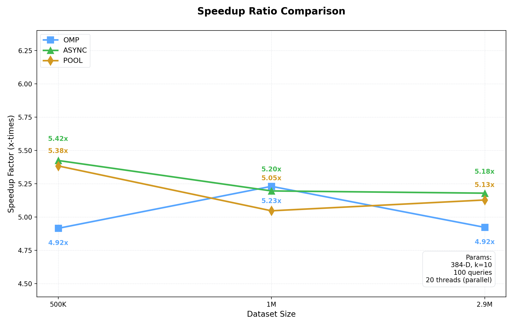
</picture>
Figure 2. Speedup relative to ST vs dataset size. All parallel variants converge to a similar speedup envelope of roughly ~5× at 20 threads, and this plateau is largely stable from 500K to 2.9M vectors.

Despite increasing dataset size, speedup for OMP/ASYNC/POOL remains in a narrow band (~5×). This stability strongly suggests a memory-bandwidth–limited regime: once the scan saturates effective memory bandwidth, additional parallelism provides diminishing returns. In other words, the bottleneck shifts from compute to data movement (RAM → cache → core).

| Dataset | OMP speedup | ASYNC speedup | POOL speedup |
| ------- | ----------: | ------------: | -----------: |
| 500K    |      4.92×    |    **5.43×**    |    5.39×   |
| 1M      |     **5.23×**   |      5.19× |     5.05×   |
| 2.9M    |   4.92×   |  **5.18×**   |    5.13×     |

Table 2. speedup

### 2.3 Tail stability differs by runtime strategy (p99 / Avg)
<picture>
  <source media="(prefers-color-scheme: dark)" srcset="performance_images/stability_final_dark.png">
  
</picture>
Figure 3. Tail stability measured as p99 / Avg (lower is better). This highlights that methods with similar average throughput can differ meaningfully in tail behavior, especially as the working set grows.

While average latency for OMP/ASYNC/POOL is similar at each dataset size, tail behavior varies. ASYNC tends to maintain a relatively tight p99/Avg ratio across sizes, whereas OMP and POOL show larger fluctuations at certain dataset sizes. This indicates that at large working-set sizes, system-level effects (scheduler noise, memory-channel contention, page/cache behavior) can meaningfully impact tail latency even when average throughput is bandwidth-limited.

| Dataset | OMP p99/Avg | ASYNC p99/Avg | POOL p99/Avg |
| ------- | ----------: | ------------: | -----------: |
| 500K    |25.418|**19.869**|  20.921|
| 1M      |**39.573** |40.650|46.829 |
| 2.9M    | 123.672|**114.750**|124.335|

Table 3. Tail stability

### 2.4 Key takeaway

With 20-way parallelism, flat scan achieves a stable ~5× speedup from 500K to 2.9M vectors, implying that performance is largely bounded by effective memory bandwidth rather than compute. Therefore, further gains will likely require reducing bytes/query (e.g., quantization, compression, or ANN pruning) rather than increasing thread count.

### 2.5 Thread Scaling at 500K (POOL vs ASYNC)

To identify the scalability “sweet spot” and quantify diminishing returns, we performed a thread-scaling sweep on the 500K dataset (384-D, k=10, 100 queries), comparing POOL and ASYNC across {1, 2, 4, 8, 12, 16, 20} threads.

<picture> <source media="(prefers-color-scheme: dark)" srcset="performance_images/scalability_final_dark.png"> 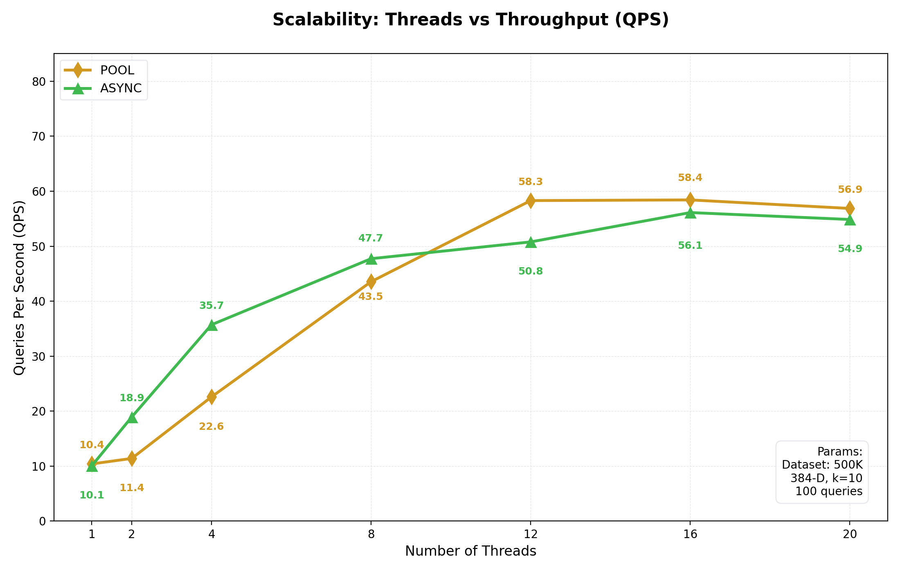 </picture>

Figure 4. Scalability on 500K vectors: throughput (QPS) vs thread count for POOL and ASYNC. Both methods improve rapidly at low thread counts and then plateau, consistent with a transition to a memory-bandwidth–limited regime. POOL reaches its peak around 12–16 threads (≈58 QPS) and slightly regresses at 20 threads, while ASYNC increases more smoothly up to 16–20 threads but converges to a similar saturation ceiling.

Overall, both implementations scale strongly up to 8 threads (POOL: 10.4 → 43.5 QPS; ASYNC: 10.1 → 47.7 QPS), after which gains diminish markedly. POOL achieves its highest throughput at 12–16 threads (≈58.3 QPS), suggesting this range is the practical operating point on this platform. Beyond saturation, increasing to 20 threads does not improve throughput and may slightly degrade it (POOL), indicating bandwidth contention and parallel overhead outweigh further parallelism.

> Recommended setting (500K): POOL at 16 threads (or 12) provides near-peak throughput with minimal incremental benefit from higher thread counts.

| threads | Avg (ms/q) |    QPS | speedup vs 1 |
| ------: | ---------: | -----: | -----------: |
|       1 |     96.141 | 10.401 |        1.00× |
|       2 |     87.743 | 11.397 |        1.10× |
|       4 |     44.271 | 22.588 |        2.17× |
|       8 |     22.967 | 43.540 |        4.19× |
|      12 |     17.156 | 58.288 |    **5.60×** |
|      16 |     17.120 | 58.413 |    **5.62×** |
|      20 |     17.587 | 56.860 |        5.47× |

Table 4a. 500K — POOL thread scaling

| threads | Avg (ms/q) |    QPS | speedup vs 1 |
| ------: | ---------: | -----: | -----------: |
|       1 |     99.346 | 10.066 |        1.00× |
|       2 |     52.837 | 18.926 |    **1.88×** |
|       4 |     28.004 | 35.710 |    **3.55×** |
|       8 |     20.954 | 47.724 |        4.74× |
|      12 |     19.695 | 50.775 |        5.05× |
|      16 |     17.822 | 56.112 |    **5.58×** |
|      20 |     18.231 | 54.852 |        5.45× |

Table 4b. 500K — ASYNC thread scaling

### 2.6 AVX2/FMA Microbenchmark (Compute-bound → Bandwidth-bound)

To isolate SIMD effects in the dot-product kernel, we compared a scalar-only path (NVDB_FORCE_SCALAR=1) against an AVX2+FMA auto-dispatched path (NVDB_FORCE_SCALAR=0) on the 500K dataset (384-D, k=10, 100 queries). We report both average latency and effective bandwidth to distinguish compute-limited vs bandwidth-limited regimes.

Figure 5. AVX2 effects on latency and bandwidth (500K)
<picture> <source media="(prefers-color-scheme: dark)" srcset="performance_images/unified_a_latency_dark.png"> 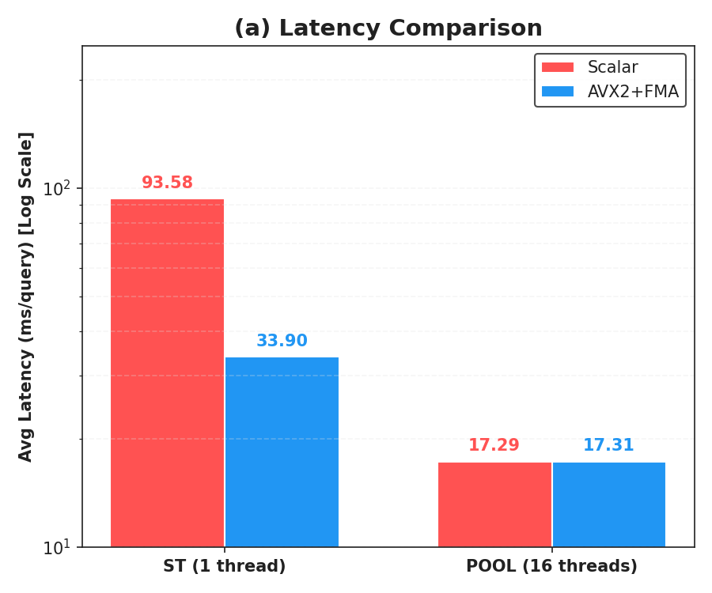 </picture>
(a) Latency comparison (log scale). AVX2+FMA dramatically reduces single-thread latency (93.58 → 33.90 ms/query), while showing negligible change under a bandwidth-saturated parallel scan (POOL@16: 17.29 vs 17.31 ms/query).
<picture> <source media="(prefers-color-scheme: dark)" srcset="performance_images/unified_b_bw_dark.png"> 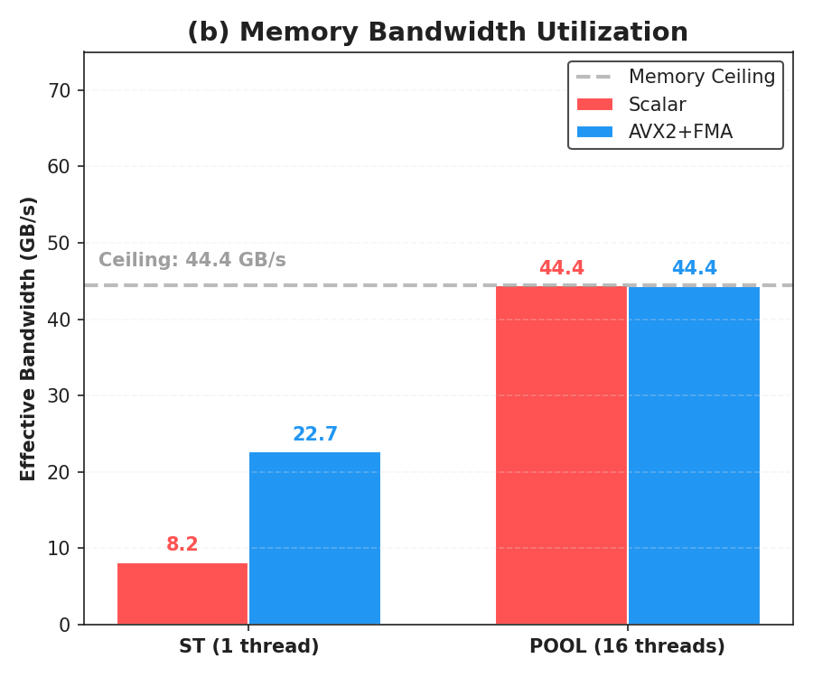 </picture>
(b) Memory bandwidth utilization. In ST (1 thread), AVX2+FMA raises effective bandwidth from 8.2 → 22.7 GB/s. In POOL@16, both scalar and AVX2+FMA reach essentially the same bandwidth (~44.4 GB/s), matching the observed memory ceiling.

| Setting             | Mode | Threads | Avg (ms/q) |    QPS | p95 (ms) | p99 (ms) | bytes/query | Effective BW (GB/s) |
| ------------------- | ---- | ------: | ---------: | -----: | -------: | -------: | ----------: | ------------------: |
| **Scalar (forced)** | ST   |       1 |     93.585 | 10.686 |   95.503 |  104.690 | 768,000,000 |               8.206 |
| **AVX2+FMA (auto)** | ST   |       1 |     33.898 | 29.501 |   34.442 |   34.712 | 768,000,000 |              22.656 |
| **Scalar (forced)** | POOL |      16 |     17.288 | 57.842 |   17.842 |   18.241 | 768,000,000 |              44.423 |
| **AVX2+FMA (auto)** | POOL |      16 |     17.307 | 57.782 |   17.841 |   17.926 | 768,000,000 |              44.376 |

Table 5. SIMD impact under different bottleneck regimes (500K vectors)

#### Interpretation

This experiment highlights a clear bottleneck transition. In the single-thread regime, performance is compute-limited: AVX2+FMA provides a 2.76× latency reduction (93.58 → 33.90 ms/query) and enables substantially higher effective bandwidth (8.2 → 22.7 GB/s). In contrast, at 16 threads with a pinned thread pool, the scan is already bandwidth-saturated near the platform ceiling (~44–45 GB/s). Consequently, scalar vs AVX2+FMA yields no meaningful end-to-end difference (17.29 vs 17.31 ms/query; ~44.4 GB/s).

>Takeaway: SIMD is essential for improving low-thread performance and reducing the thread count required to approach saturation; once bandwidth-bound, further improvements must primarily come from reducing bytes/query (e.g., FP16/INT8 quantization/compression) or avoiding full scans (ANN pruning).

##  3. FP16 Base to Reduce Data Movement (Bandwidth Scaling on Alder Lake)

This phase evaluates FP16 base embeddings as a data-movement optimization. Since flat scan becomes memory-bandwidth bound at moderate-to-high parallelism, halving bytes/query should yield near-linear throughput gains once the memory subsystem is saturated. We convert the base matrix from FP32 → FP16 (query vectors remain FP32) and benchmark ST/OMP/ASYNC/POOL with k=10 and 100 queries.

### 3.1 FP16 reaches bandwidth saturation at low thread counts
<picture> <source media="(prefers-color-scheme: dark)" srcset="performance_images/bw_sat_dark.png"> 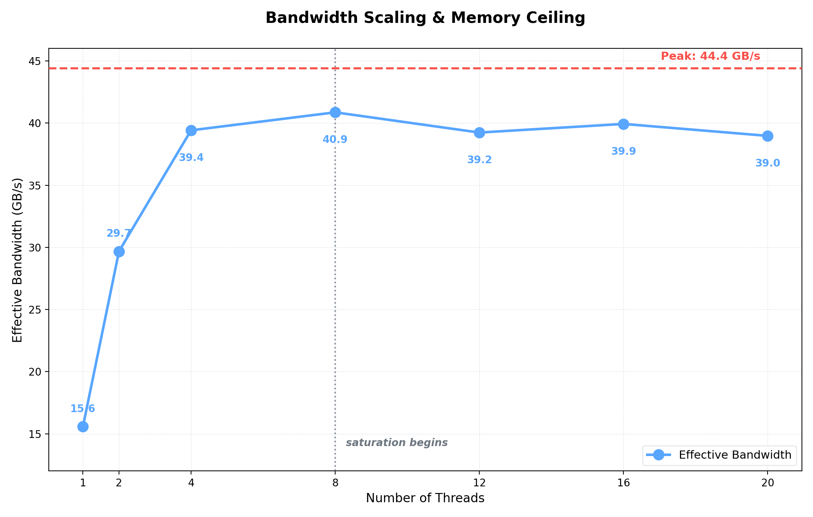 </picture>
Figure 4. Effective bandwidth vs thread count (500K, FP16, OMP). Bandwidth increases rapidly from 1→4 threads and begins saturating around ~8 threads, remaining near ~39–41 GB/s thereafter. The dashed line indicates the measured peak bandwidth ceiling (~44.4 GB/s).

Interpretation. FP16 reduces bytes/query by 2× relative to FP32, so the scan becomes bandwidth-limited sooner. After ~8 threads, increasing thread count provides little additional bandwidth, indicating that further throughput gains require reducing data movement (bytes/query) rather than adding CPU parallelism.

### 3.2 FP16 throughput at a fixed 8 threads (POOL vs OMP across sizes)
<picture> <source media="(prefers-color-scheme: dark)" srcset="performance_images/qps_comparison_8threads_dark.png"> 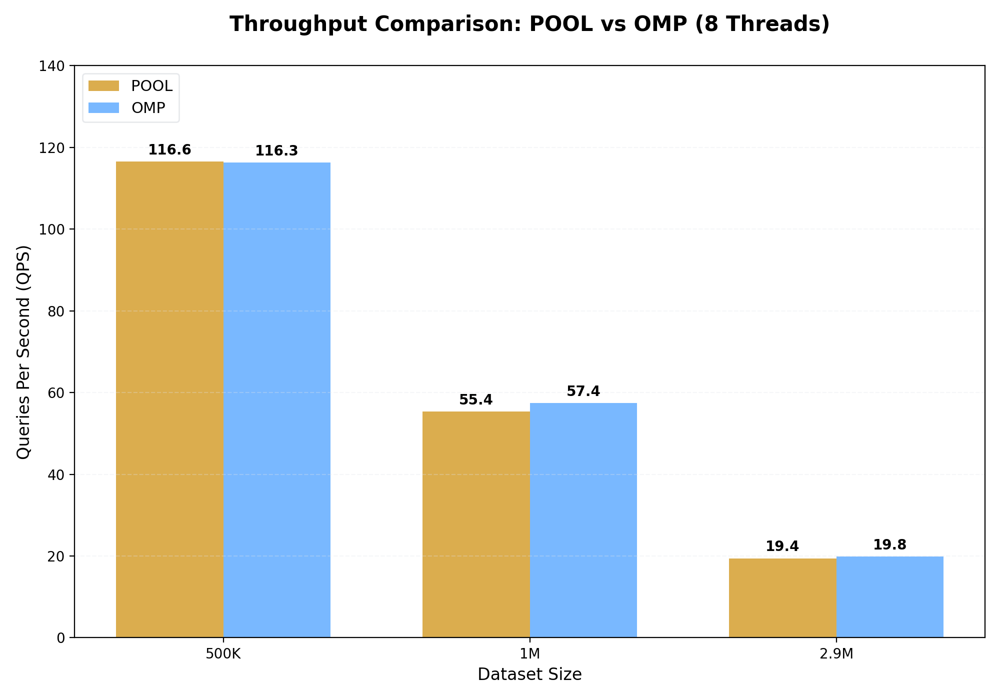 </picture>
Figure 5. FP16 throughput comparison at 8 threads across dataset sizes. POOL and OMP achieve similar QPS at 500K, and remain close at 1M and 2.9M, consistent with both being constrained by the same memory ceiling.

| Dataset | Method | Threads | Avg (ms/q) |     QPS | p95 (ms) | p99 (ms) |   bytes/query | Effective BW (GB/s) |
| ------- | ------ | ------: | ---------: | ------: | -------: | -------: | ------------: | ------------------: |
| 500K    | POOL   |       8 |      8.578 | 116.574 |    8.900 |    9.239 |   384,000,000 |              44.765 |
| 500K    | OMP    |       8 |      8.601 | 116.260 |    8.935 |    9.375 |   384,000,000 |              44.644 |
| 1M      | POOL   |       8 |     18.066 |  55.353 |   19.421 |   20.573 |   768,000,000 |              42.511 |
| 1M      | OMP    |       8 |     17.423 |  57.395 |   18.373 |   18.744 |   768,000,000 |              44.079 |
| 2.9M    | POOL   |       8 |     51.445 |  19.438 |   54.710 |   56.109 | 2,229,545,472 |              43.339 |
| 2.9M    | OMP    |       8 |     50.451 |  19.821 |   51.174 |   51.906 | 2,229,545,472 |              44.193 |

Table 6. FP16 @ 8 threads (k=10, 100 queries, 384-D)

Interpretation. With FP16 bases, both POOL and OMP at 8 threads reach ~42–45 GB/s effective bandwidth across sizes. Differences in QPS are small, indicating both methods are bounded by the same memory subsystem. At larger working sets (1M/2.9M), OMP slightly improves bandwidth utilization and tail latency (p95/p99), while POOL remains competitive but shows higher tail in some runs.

### 3.3 Hybrid (Alder Lake) “sweet spot”: more threads can worsen tail latency
<picture> <source media="(prefers-color-scheme: dark)" srcset="performance_images/stability_qps_dark.png">  </picture>
Figure 6. 1M FP16 POOL: throughput (QPS) and stability (p99/Avg) vs threads. 8 threads yields the best throughput and stable tail behavior, while 16 threads shows a noticeably higher p99/Avg ratio, indicating degraded tail latency.

| Threads | Avg (ms/q) |    QPS | p95 (ms) | p99 (ms) | p99/Avg |
| ------: | ---------: | -----: | -------: | -------: | ------: |
|       8 |     17.135 | 58.362 |   17.874 |   17.941 |   1.047 |
|      12 |     18.053 | 55.393 |   18.702 |   18.786 |   1.041 |
|      16 |     17.856 | 56.005 |   20.209 |   21.561 |   1.208 |

Table 7. 1M FP16 POOL thread sensitivity (k=10, 100 queries)

Interpretation (Hybrid CPU). The i7-12700 (8P + 4E, 20 threads) is a hybrid architecture. Under FP16, bandwidth saturation occurs at relatively low thread counts (often near the P-core count). Increasing threads beyond this point does not improve effective bandwidth and may worsen tail latency due to contention and straggler effects (E-cores and/or SMT siblings). Therefore, for FP16 scans, 8 threads is a robust operating point on this platform.

### 3.4 Engineering note: affinity pitfalls in remote/hybrid environments

We observed that remote/session-level affinity constraints (e.g., CRD/systemd/cgroup) can silently restrict the process to a small CPU set, causing severe underutilization of memory bandwidth (e.g., dropping from ~44 GB/s to ~16–27 GB/s). For reproducibility, benchmarks should record and control CPU affinity (e.g., taskset -pc <pid>), and pinning policies should be core-aware on hybrid CPUs. Our POOL implementation mitigates this by using sysfs CPU topology metadata to select an appropriate core set.

### 3.5 Takeaways

FP16 halves bytes/query, enabling near-linear throughput gains once the scan is bandwidth-limited.
On Alder Lake hybrid CPUs, FP16 shifts saturation to fewer threads (often around the P-core count).
Beyond saturation, adding threads can increase tail latency without improving effective bandwidth.
Reliable benchmarking requires explicit attention to affinity/pinning, especially in remote or hybrid environments.
## 3B.  INT8 Base Quantization (AVX2) — Further Reducing Bytes/Query

To extend the FP16-base experiments, we further reduce data movement by quantizing the **base matrix** to INT8 while **keeping queries in FP32**. The INT8 format uses a **per-row scale** (one FP32 value per vector) and stores base vectors as `int8` payload. Scoring uses an **AVX2** kernel that accumulates the `int8` payload via widened int16/int32 intermediates, converts to FP32 for accumulation with FP32 queries, and applies the per-row FP32 scale. This yields a deterministic flat-scan ranking under a quantized scoring function, preserving flat-scan semantics (no ANN pruning) while reducing bytes/query. Unless otherwise noted, experiments use 384-D embeddings, k=10, Q=100, and OMP@8 (`OMP_PROC_BIND=close`,` OMP_PLACES=cores`).

### 3B.1 INT8 improves throughput across dataset sizes
<picture> <source media="(prefers-color-scheme: dark)" srcset="performance_images/P4B_1_Throughput_dark.png"> 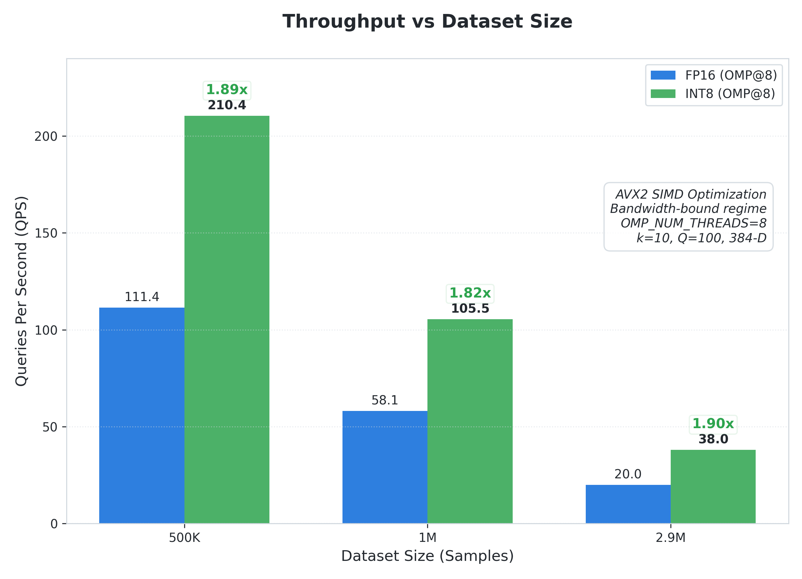 </picture>

Figure 7. Throughput (QPS) vs dataset size comparing FP16 and INT8 bases (OMP@8). INT8 achieves ~1.8–1.9× higher throughput across sizes, approaching the ideal gain expected from reducing bytes/query.

bytes/query counts base-vector payload reads (plus INT8 per-row scale), excluding query reuse and top-k bookkeeping.

| Dataset | Base dtype    | Avg_query (ms) |     QPS | p95 (ms) | p99 (ms) |   bytes/query |
| ------- | ------------- | -------------: | ------: | -------: | -------: | ------------: |
| 500K    | FP16          |          8.973 | 111.445 |   10.204 |   13.136 |   384,000,000 |
| 500K    | INT8 (+scale) |          4.753 | 210.414 |    6.428 |    8.732 |   194,000,000 |
| 1M      | FP16          |         17.220 |  58.073 |   18.010 |   18.380 |   768,000,000 |
| 1M      | INT8 (+scale) |          9.477 | 105.520 |   11.207 |   12.481 |   388,000,000 |
| 2.9M    | FP16          |         50.019 |  19.992 |   51.830 |   55.058 | 2,229,545,472 |
| 2.9M    | INT8 (+scale) |         26.340 |  37.966 |   27.572 |   29.721 | 1,126,384,952 |

Table 8. FP16 vs INT8 (OMP@8)

Observed throughput speedup (INT8 vs FP16) is 1.89× (500K), 1.82× (1M),
and 1.90× (2.9M).

### 3B.2 Payload-equivalent bandwidth stays in the same 42–45 GB/s regime
<picture> <source media="(prefers-color-scheme: dark)" srcset="performance_images/P4B_2_Bandwidth_Refined_dark.png"> 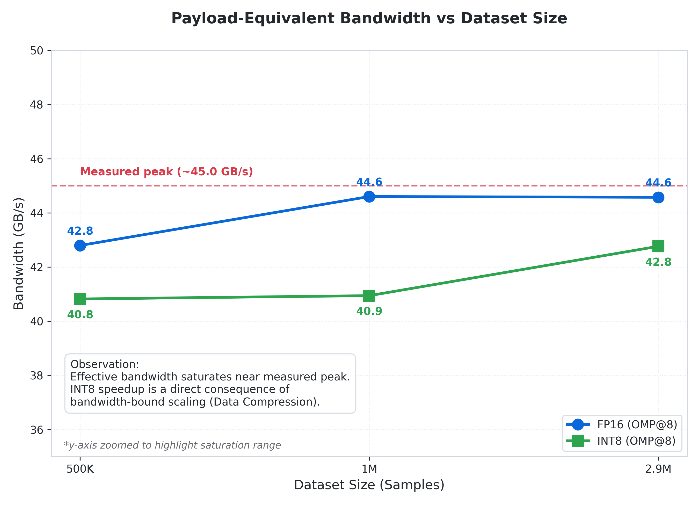 </picture>

Figure 8. Payload-equivalent bandwidth vs dataset size (OMP@8; y-axis zoomed). Both FP16 and INT8 saturate in the ~42–45 GB/s range, indicating the same bandwidth-saturation regime; INT8 improves QPS primarily by reducing bytes/query rather than increasing physical memory bandwidth.

| Dataset | FP16 BW (GB/s) | INT8 BW (GB/s) |
| ------- | -------------: | -------------: |
| 500K    |         42.795 |         40.820 |
| 1M      |         44.600 |         40.942 |
| 2.9M    |         44.574 |         42.764 |

Table 9. Payload-equivalent bandwidth (OMP@8)
**Interpretation.** INT8 reduces bytes/query by ~2× relative to FP16 (dim·1B + 4B scale vs dim·2B). Once the scan is bandwidth-limited, throughput increases close to proportionally. The remaining gap to the ideal 2× is attributable to dequantization overhead (int8→float conversion and scaling) and fixed per-query costs (top-k maintenance and parallel overhead). Notably, tail latency (p95/p99) improves substantially under INT8 at large scale, consistent with reduced data movement pressure. This confirms that, once bandwidth-limited, INT8 acts primarily as a data-movement optimization rather than a compute optimization.

### 3B.3 Takeaways

* **INT8(+scale) with an AVX2 kernel delivers consistent ~1.8–1.9× throughput gains over FP16** from 500K to 2.9M vectors under OMP@8.
* **The bandwidth ceiling stays in the ~42–45 GB/s class**; the improvement is driven by reducing bytes/query, not increasing physical DRAM bandwidth.
* After vectorization, the INT8 path re-enters a bandwidth-limited regime, where performance scales primarily with bytes/query rather than FLOPs.

##  4. Query Batching, Cache Tiling, and Tail Behavior (Fullset FP16, 2.9M)

We extend Section 3 by introducing **query batching**: processing multiple queries (batch size `batch_q`) while streaming the base matrix once, thereby amortizing base-matrix streaming cost by reusing hot base tiles while they remain in LLC/cache.  In this section, we report Avg_query and batch-level p99 latency (Route A), where percentiles are computed over batch runtimes (`batch_samples = ceil(Q / batch_q)`), and note that the derived `payload_equiv_bandwidth_GBps` can exceed DRAM peak due to cache reuse.

### 4.1 Query batching: throughput scales strongly with batch size
<picture> <source media="(prefers-color-scheme: dark)" srcset="performance_images/QB_QPS_dark.png"> 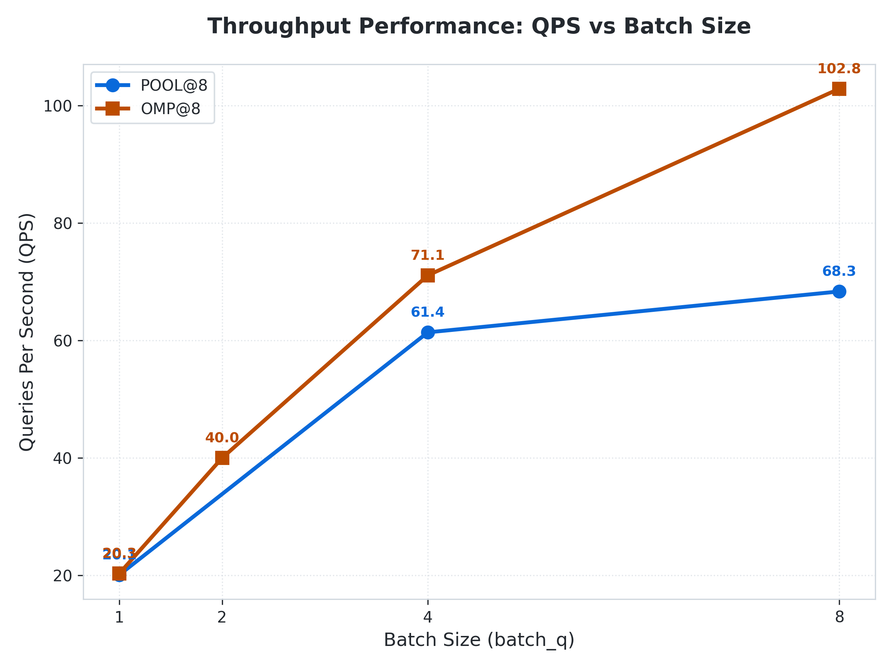 </picture>
Figure 9. QPS vs batch size (Fullset FP16, 2.9M, threads=8, tile=1024).

Both POOL and OMP benefit from batching, but OMP achieves substantially higher throughput at larger batch sizes. 

* **OMP@8**: 20.3 → 40.0 → 71.1 → 102.8 QPS for batch_q = 1/2/4/8
* **POOL@8**: 20.1 → 37.2 → 61.4 → 67.2 QPS for batch_q = 1/2/4/8

**Interpretation.** Batching reduces redundant streaming of the base matrix across queries and shifts the bottleneck away from DRAM bandwidth. OMP continues scaling to `batch_q=8`, while POOL shows earlier saturation from `batch_q=4→8`, indicating higher overheads (thread management, local Top-k maintenance, and merge costs) in the bench-side POOL batching implementation. This suggests that once DRAM traffic is amortized, batching performance becomes dominated by software overheads rather than memory bandwidth. This gap is specific to the current batching implementation (merge/overhead), not the pinned-pool design itself.

### 4.2 Tail behavior: batch-level p99 decreases with batching, OMP is consistently tighter

<picture> <source media="(prefers-color-scheme: dark)" srcset="performance_images/QB_P99_dark.png"> 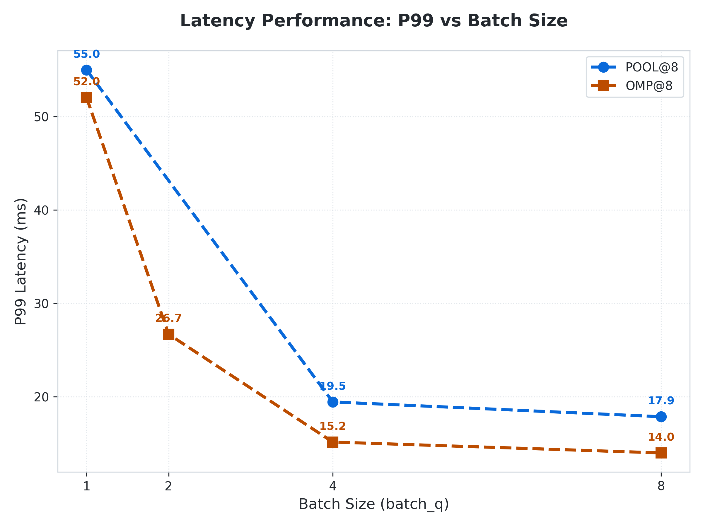 </picture>

Figure 10. Batch-level p99 vs batch size (Fullset FP16, 2.9M, threads=8, tile=1024).
Batching not only increases throughput but also substantially reduces batch-level p99 compared to `batch_q=1` . OMP remains consistently tighter than POOL.

* **OMP@8 p99 (batch ms)**: 52.0 → 26.7 → 15.2 → 14.0
* **POOL@8 p99 (batch ms)**: 55.0 → 28.9 → 19.5 → 17.9

**Interpretation.**  Larger batches increase compute work per streamed base tile, but also increase reuse within cache/LLC, lowering batch completion time and thus batch-level tail latency. The OMP implementation achieves lower p99 at the same batch size, suggesting more efficient parallel scheduling and lower merge overhead compared with the bench-side POOL batching path.

### 4.3 Cache tiling sensitivity (POOL@8, batch_q=4)

To test whether tile granularity affects performance under batching, we swept `tile_vecs ∈ {512, 1024, 2048}` at fixed `batch_q=4` (Fullset FP16, POOL@8). Results show negligible sensitivity across this range.

| tile_vecs | Avg_query (ms) |    QPS | Avg_batch (ms) | batch_p95 (ms) | batch_p99 (ms) |
| --------: | -------------: | -----: | -------------: | -------------: | -------------: |
|       512 |         16.381 | 61.047 |         65.523 |         73.087 |         77.574 |
|      1024 |         16.501 | 60.604 |         66.002 |         74.511 |         77.026 |
|      2048 |         16.433 | 60.852 |         65.734 |         74.688 |         77.909 |

Table 10. Tile size sweep (Fullset FP16, POOL@8, batch_q=4)

**Interpretation.** With query batching enabled, performance is largely dominated by query reuse and merge/overhead rather than tile granularity in the tested range. We therefore adopt **tile_vecs=1024** as a stable default.

### 4.4 Takeaways

* **Batching provides multi-× throughput gains** on the 2.9M FP16 workload: up to ~5.1× for OMP@8 (batch_q=8) and ~3.3× for POOL@8.
* **Batch-level p99 drops sharply with batching**, indicating improved tail behavior under cache reuse.
* **OMP batching outperforms POOL batching** at larger batch sizes, implying that once DRAM traffic is amortized, implementation overheads (merge/scheduling) dominate.
* `payload_equiv_bandwidth_GBps`may exceed DRAM peak under batching because it is computed from payload bytes/query and Avg_query; this reflects cache reuse, not physical DRAM bandwidth.  Note that `payload_equiv_bandwidth_GBps` is computed from payload bytes/query ÷ Avg_query. Under batching, reused base tiles may be served from LLC, so this metric can exceed DRAM peak; it should be interpreted as an effective payload rate, not physical DRAM bandwidth.

## 4B. Software Prefetch Experiments (OMP@8, Fullset FP16)

After enabling query batching and cache tiling, we evaluated explicit software prefetching to further reduce cache-miss latency during the base scan. We instrumented the inner loop with `__builtin_prefetch` targeting row `vi + prefetch_dist` and swept `prefetch_dist` under two tiling regimes while keeping all other parameters fixed (`batch_q=4`, Q=1000, OMP@8, FP16 fullset). We report **Avg_query**, QPS, and **batch-level** tail latency (Route A; percentiles over `batch_samples = ceil(Q/batch_q)`).

### 4B.1 Prefetch sweep (tile_vecs=512)

<picture> <source media="(prefers-color-scheme: dark)" srcset="performance_images/P5_3_QPS_dark.png"> 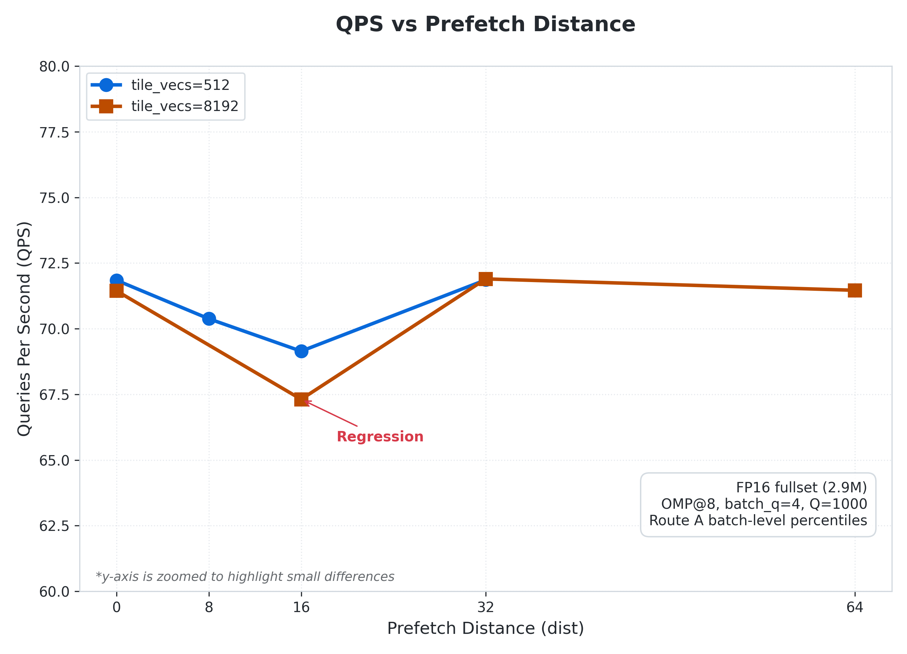 </picture>

Figure 11. QPS vs Prefetch Distance (OMP@8, batch_q=4, Q=1000)

<picture> <source media="(prefers-color-scheme: dark)" srcset="performance_images/P5_3_P99_dark.png"> 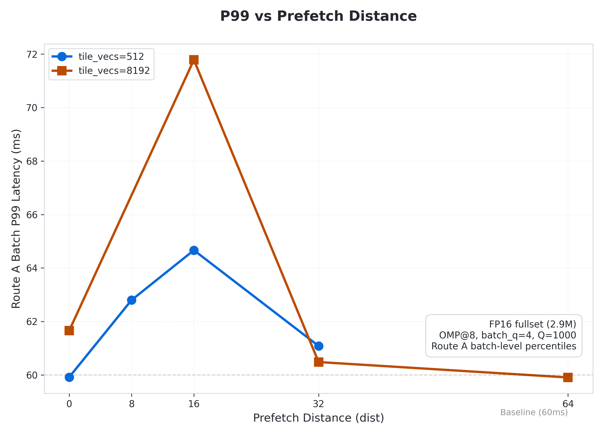 </picture>

Figure 12. Batch p99 vs Prefetch Distance (OMP@8, batch_q=4, Q=1000)

| prefetch_dist | Avg_query (ms) |    QPS | Avg_batch (ms) | batch_p95 (ms) | batch_p99 (ms) | batch_samples |
| ------------: | -------------: | -----: | -------------: | -------------: | -------------: | ------------: |
|             0 |         13.919 | 71.845 |         55.676 |         59.530 |         59.916 |           250 |
|             8 |         14.209 | 70.379 |         56.835 |         61.609 |         62.799 |           250 |
|            16 |         14.462 | 69.145 |         57.849 |         62.358 |         64.664 |           250 |
|            32 |         13.916 | 71.861 |         55.663 |         58.819 |         61.084 |           250 |

Table 11. Prefetch sweep (tile_vecs=512, batch_q=4, Q=1000, OMP@8, FP16 fullset)

At `tile_vecs=512`, software prefetching shows **no consistent throughput improvement**. Short distances (8/16) reduce QPS and worsen batch-level tail latency, while `prefetch_dist=32` is statistically similar to the no-prefetch baseline.

* `prefetch_dist=0`: 71.845 QPS, batch_p99 59.916 ms
* `prefetch_dist=8`: 70.379 QPS, batch_p99 62.799 ms
* `prefetch_dist=16`: 69.145 QPS, batch_p99 64.664 ms
* `prefetch_dist=32`: 71.861 QPS, batch_p99 61.084 ms

**Interpretation.** With batching+tiling, the scan is already a sequential streaming pattern well served by hardware prefetchers and cache reuse. Software prefetching is non-monotonic: poorly tuned distances can introduce cache pollution or unnecessary memory traffic, degrading both throughput and tail latency. Differences at `prefetch_dist=32 `are within run-to-run variance and do not indicate a robust or reproducible gain.

### 4B.2 Prefetch sweep under larger tiles (tile_vecs=8192)

| prefetch_dist | Avg_query (ms) |    QPS | Avg_batch (ms) | batch_p95 (ms) | batch_p99 (ms) | batch_samples |
| ------------: | -------------: | -----: | -------------: | -------------: | -------------: | ------------: |
|             0 |         13.998 | 71.441 |         55.991 |         60.090 |         61.656 |           250 |
|            16 |         14.856 | 67.313 |         59.424 |         67.655 |         71.783 |           250 |
|            32 |         13.909 | 71.897 |         55.635 |         59.026 |         60.482 |           250 |
|            64 |         13.993 | 71.464 |         55.972 |         59.289 |         59.906 |           250 |

Table 12 . Prefetch sweep (tile_vecs=8192, batch_q=4, Q=1000, OMP@8, FP16 fullset)

To stress cache behavior further, we repeated the sweep at `tile_vecs=8192`. Most distances remain close to the baseline, but an intermediate distance (`prefetch_dist=16`) significantly degrades performance and tail latency.

* `prefetch_dist=0`: 71.441 QPS, batch_p99 61.656 ms
* `prefetch_dist=32`: 71.897 QPS, batch_p99 60.482 ms
* `prefetch_dist=64`: 71.464 QPS, batch_p99 59.906 ms
* `prefetch_dist=16`: 67.313 QPS, batch_p99 71.783 ms

**Interpretation.** Even under larger tiles, software prefetch does not provide a stable improvement. The strong regression at `prefetch_dist=16` reinforces that prefetch tuning can be counterproductive, and that once batching amortizes DRAM traffic, performance is dominated by reuse/overheads rather than miss-latency hiding.

### 4B.3 Takeaway

On top of batching and tiling, explicit software prefetching does not provide a **robust performance benefit** and may **worsen tail latency** depending on the chosen distance. Once query batching amortizes DRAM traffic, performance becomes dominated by cache reuse and merge overheads, leaving little headroom for software prefetching. We therefore keep `prefetch_dist=0` in subsequent experiments and prioritize higher-impact optimizations (e.g., INT8 quantization or pruning/ANN).

### 4C. INT8 + Query Batching (Fullset, OMP@8): Throughput–Tail Frontier

To examine whether data reduction (INT8) and cache reuse (query batching) compose multiplicatively, we benchmarked **fullset (2.9M)** flat scan under the same batching setup used in Section 4: **OMP@8**, `tile_vecs=512`, and **Q=1000** queries with `k=10`. We compare **FP16 base** against **INT8(+scale)** base. For batching runs (`batch_q>1`), tail metrics are reported as **batch-level p99** (Route A), where percentiles are computed over `batch_samples = ceil(Q / batch_q)`.

<picture> <source media="(prefers-color-scheme: dark)" srcset="performance_images/P7_Batching_QPS_dark.png"> 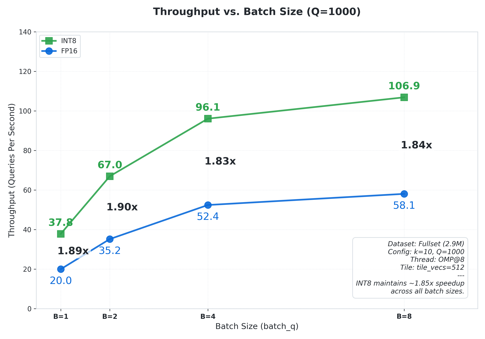 </picture>

Figure 12. Throughput (QPS) vs batch size on the 2.9M fullset (k=10, Q=1000, OMP@8, tile_vecs=512). INT8 maintains a consistent ~1.85–1.90× throughput advantage over FP16 across batch sizes, while both benefit strongly from batching.

| dtype | batch_q | Avg_query (ms) |      QPS | Avg_batch (ms) | batch_p99 (ms) | batch_samples |
| ----- | ------: | -------------: | -------: | -------------: | -------------: | ------------: |
| FP16  |       1 |         50.728 |   19.713 |              N/A |              N/A |          N/A |
| FP16  |       2 |         25.361 |   39.431 |         50.722 |         58.298 |           500 |
| FP16  |       4 |         14.126 |   70.793 |         56.503 |         71.495 |           250 |
| FP16  |       8 |          9.884 |  101.173 |         79.073 |         98.363 |           125 |
| INT8  |       1 |         26.430 |   37.836 |              N/A |              N/A |N/A |
| INT8  |       2 |         14.930 |   66.978 |         29.860 |         33.006 |           500 |
| INT8  |       4 |         10.406 |   96.097 |         41.625 |         50.319 |           250 |
| INT8  |       8 |         9.356* | 106.884* |        74.849* |        85.847* |           125 |

Table 13. Throughput scaling with batching (Fullset 2.9M, OMP@8, tile=512)

\* INT8 `batch_q=8` values are reported as the mean of two repeated runs (to reduce sensitivity from the smaller batch sample count).

> Note: batch-level tail metrics (Avg_batch, batch_p99) are defined only for `batch_q > 1` (Route A). For `batch_q = 1`, we report per-query latency percentiles elsewhere.

<picture> <source media="(prefers-color-scheme: dark)" srcset="performance_images/P7_2_Batch_P99_dark.png"> 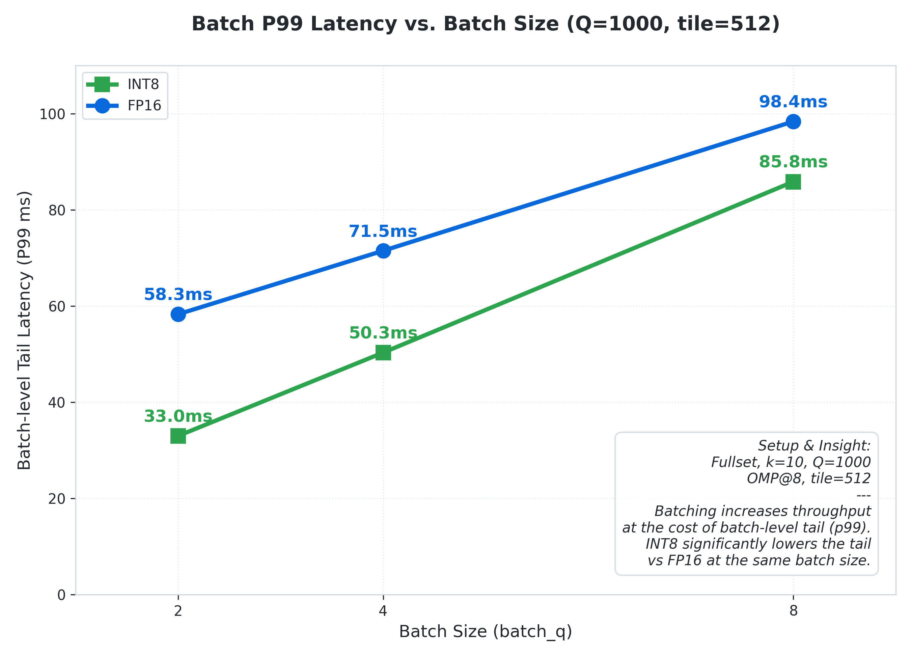 </picture>

Figure 13. Batch-level p99 latency vs batch size (`batch_q ∈ {2,4,8})` under the same setup. While batching increases throughput, it also increases **batch-level tail (p99)**. INT8 consistently yields lower batch p99 than FP16 at the same batch size.

<picture> <source media="(prefers-color-scheme: dark)" srcset="performance_images/P7_3_Dominance_dark.png"> 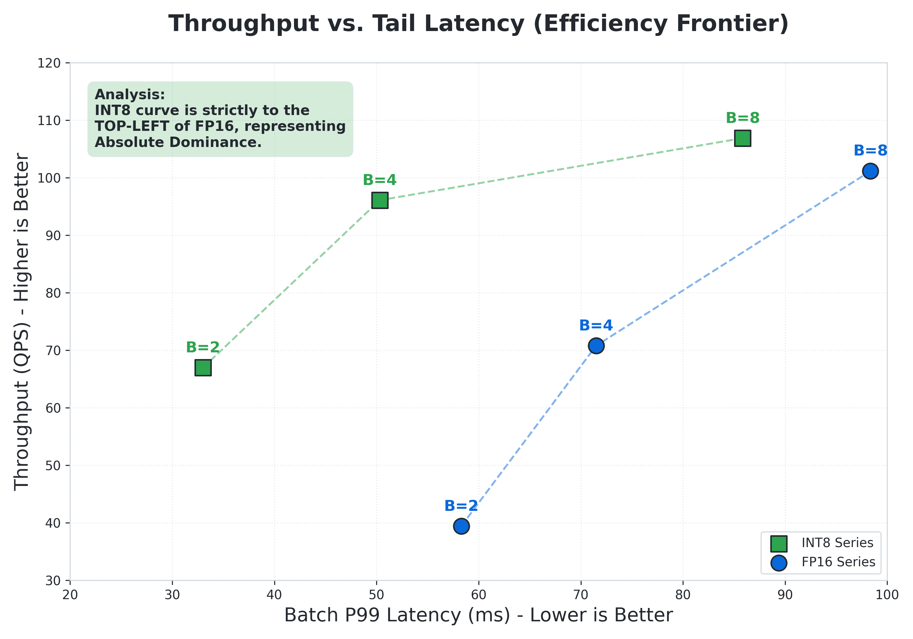 </picture>

Figure 14. Efficiency frontier (QPS vs batch p99). INT8 points lie strictly up-left of FP16 for all tested batch sizes, indicating a dominant tradeoff curve: higher throughput at lower tail latency within this configuration.

**Interpretation**

**(1) Batching provides multi-× throughput gains for both formats.**
Relative to `batch_q=1`, throughput increases to **~101 QPS (FP16)** and **~107 QPS (INT8)** at `batch_q=8`, consistent with amortizing base streaming across multiple queries and reusing hot cache lines within each tile.

**(2) INT8 preserves a stable throughput advantage even under heavy batching.**
INT8 is consistently faster than FP16 across all batch sizes, maintaining **~1.83–1.90×**higher QPS. This indicates that even when batching reduces DRAM traffic pressure, INT8 still benefits from reduced payload movement and more cache-friendly working sets.

**(3) Tail tradeoff is batch-dependent, but INT8 improves the frontier.**
Batch-level p99 increases with `batch_q` for both formats (larger batches imply longer per-batch completion times). However, INT8 reduces tail substantially at the same batch size (e.g., `batch_q=4`: **50.3 ms** vs **71.5 ms**; `batch_q=8`: **85.8 ms** vs **98.4 ms**), yielding a strictly better throughput–tail tradeoff curve.

**(4) Interpreting “payload_equiv_bandwidth” under batching.**
When batching is enabled, the reported `payload_equiv_bandwidth_GBps` can exceed the measured DRAM peak because it is computed from payload bytes/query divided by Avg_query; the apparent “>DRAM” values reflect cache reuse and amortization, not physical DRAM bandwidth.

Practical recommendation (Fullset 2.9M, OMP@8, tile=512): `batch_q=4` is a strong operating point balancing throughput and tail. `batch_q=8` maximizes throughput but increases batch-level tail.

## 5. HNSW Baseline: Recall–Latency–Memory Tradeoffs

This phase establishes an approximate nearest neighbor (ANN) baseline using HNSW (hnswlib) and quantifies the standard tradeoff between **accuracy (Recall@10)**, **latency (Avg/p99)**, and **index footprint**. Unless otherwise stated, evaluation uses **k=10** and **Q=1000** random queries. Reported latency metrics are **ANN-only** (HNSW search time), and recall is computed against the project’s exact flat-scan ground truth (see `nvdb_hnsw_eval`).

### 5.1 efSearch sweep (500K / 1M / 2.9M)

We sweep `efSearch ∈ {16, 32, 64, 128, 256}` while holding the index build configuration fixed (HNSW M=16; efConstruction as used during index build). Across all dataset sizes, increasing efSearch consistently improves Recall@10 but increases average and tail latency.

<picture> <source media="(prefers-color-scheme: dark)" srcset="performance_images/P6_1_Tradeoff_Updated_dark.png"> 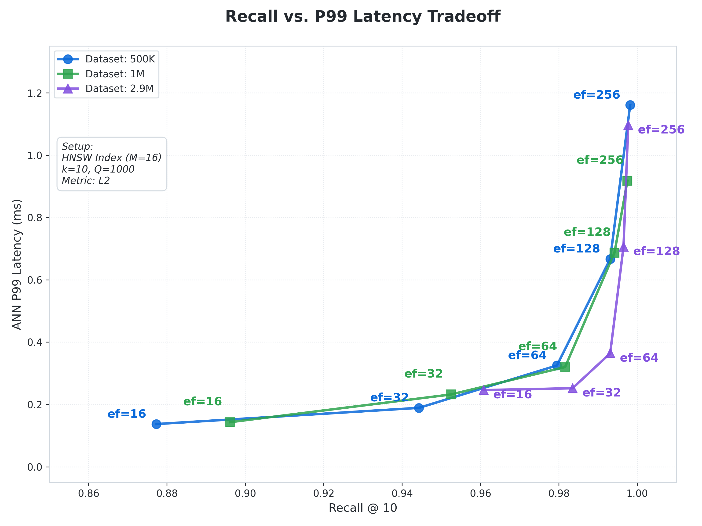 </picture>

Figure 15. Recall@10 vs ANN p99 latency (ms) for efSearch sweeps on 500K / 1M / 2.9M. Higher efSearch improves recall but increases tail latency. The “knee” typically occurs around efSearch≈64, where recall approaches ~0.98–0.99 with sub-millisecond p99.

<picture> <source media="(prefers-color-scheme: dark)" srcset="performance_images/P6_2_AvgLatency_V2_dark.png"> 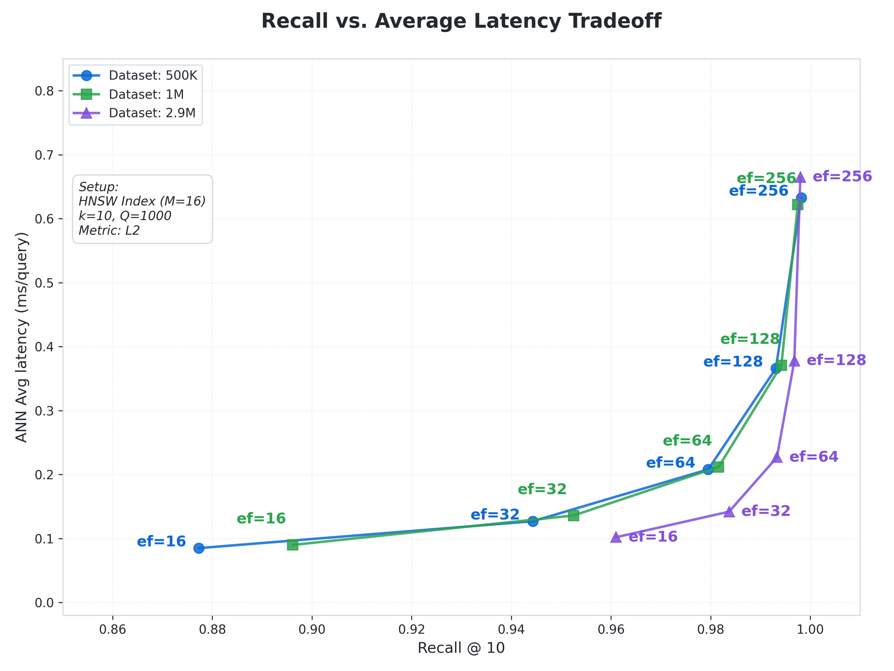 </picture>

Figure 16. Recall@10 vs ANN average latency (ms/query). Average latency rises smoothly with efSearch and mirrors the tail trend, with rapidly diminishing returns in recall beyond efSearch≈128.

| Dataset | dtype | efSearch | Recall@10 | ANN Avg (ms) | ANN p95 (ms) | ANN p99 (ms) |   ANN QPS |
| ------- | ----- | -------: | --------: | -----------: | -----------: | -----------: | --------: |
| 500K    | FP16  |       16 |    0.8773 |        0.085 |        0.119 |        0.137 | 11781.903 |
| 500K    | FP16  |       32 |    0.9443 |        0.127 |        0.164 |        0.189 |  7896.519 |
| 500K    | FP16  |       64 |    0.9795 |        0.208 |        0.264 |        0.325 |  4802.144 |
| 500K    | FP16  |      128 |    0.9931 |        0.366 |        0.507 |        0.667 |  2734.072 |
| 500K    | FP16  |      256 |    0.9982 |        0.633 |        0.882 |        1.161 |  1578.958 |
| 1M      | FP16  |       16 |    0.8961 |        0.090 |        0.122 |        0.143 | 11120.259 |
| 1M      | FP16  |       32 |    0.9525 |        0.136 |        0.183 |        0.232 |  7375.402 |
| 1M      | FP16  |       64 |    0.9816 |        0.212 |        0.266 |        0.320 |  4710.107 |
| 1M      | FP16  |      128 |    0.9942 |        0.371 |        0.502 |        0.687 |  2693.604 |
| 1M      | FP16  |      256 |    0.9975 |        0.622 |        0.790 |        0.918 |  1608.066 |
| 2.9M    | FP16  |       16 |    0.9608 |        0.147 |        0.209 |        0.246 |  6785.136 |
| 2.9M    | FP16  |       32 |    0.9835 |        0.148 |        0.193 |        0.252 |  6768.676 |
| 2.9M    | FP16  |       64 |    0.9931 |        0.222 |        0.300 |        0.364 |  4306.768 |
| 2.9M    | FP16  |      128 |    0.9965 |        0.396 |        0.514 |        0.706 |  2522.522 |
| 2.9M    | FP16  |      256 |    0.9977 |        0.682 |        0.864 |        1.096 |  1466.850 |

Table 14. efSearch sweep (ANN-only latency; k=10, Q=1000)

**Interpretation.** efSearch controls the breadth of candidate exploration at query time. Across sizes, `efSearch=64` provides a strong knee point: recall ≈0.98–0.99 with p99 remaining below ~0.4 ms (ANN-only). Increasing to `efSearch=128–256` yields marginal recall gains but a disproportionate increase in tail latency (p99 approaching or exceeding ~0.7–1.1 ms).

### 5.2 Build parameter sweep (500K): M and efConstruction vs recall/tail/memory (efSearch=64)

To characterize the second major HNSW axis—index construction quality vs search cost—we fixed `efSearch=64 `and swept build parameters `M ∈ {12,16,24}` and `efConstruction ∈ {80,200}` on the 500K dataset. We report Recall@10, ANN latency, and the on-disk index size as a proxy for memory footprint. Index size is reported as an on-disk proxy for memory footprint; runtime memory includes additional allocator overhead and is platform-dependent.

<picture> <source media="(prefers-color-scheme: dark)" srcset="performance_images/P6_3_BuildConfigs_dark.png"> 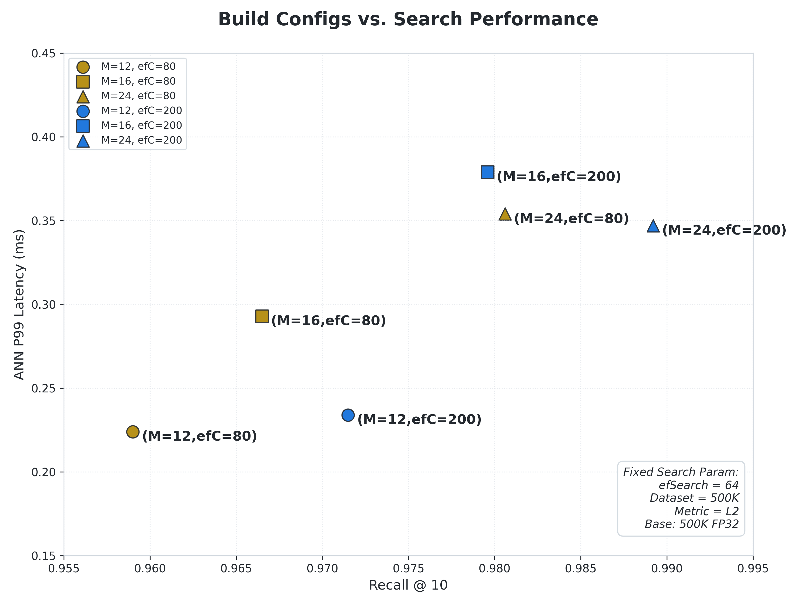 </picture>

Figure 17. Build configurations (M, efConstruction) plotted as Recall@10 vs ANN p99 at fixed efSearch=64 (500K, FP32 base). Increasing M generally improves recall but increases tail latency.

<picture> <source media="(prefers-color-scheme: dark)" srcset="performance_images/P6_4_MemoryRecall_dark.png"> 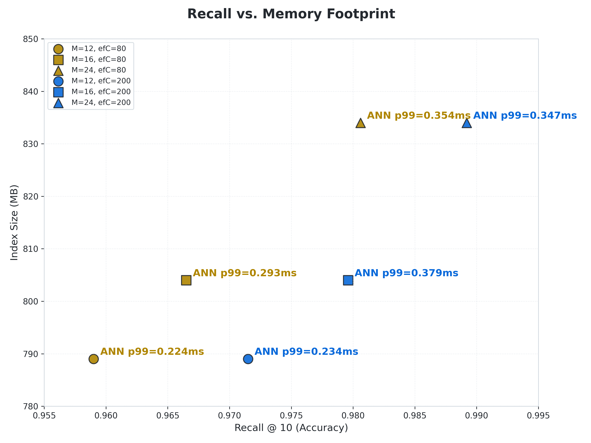 </picture>

Figure 18. Recall@10 vs index size (MB) for build sweeps at efSearch=64. Index size scales primarily with M, while efConstruction mainly affects recall at approximately constant footprint. Labels show ANN p99 latency.

|  M | efConstruction | Recall@10 | ANN Avg (ms) | ANN p95 (ms) | ANN p99 (ms) |  ANN QPS | Index size (MB) | Note                     |
| -: | -------------: | --------: | -----------: | -----------: | -----------: | -------: | --------------: | ------------------------ |
| 12 |             80 |    0.9590 |        0.155 |        0.195 |        0.224 | 6436.522 |             789 |                          |
| 16 |             80 |    0.9665 |        0.184 |        0.237 |        0.293 | 5433.366 |             804 |                          |
| 24 |             80 |    0.9806 |        0.214 |        0.286 |        0.354 | 4672.351 |             834 |                          |
| 12 |            200 |    0.9715 |        0.166 |        0.209 |        0.234 | 6015.327 |             789 |                          |
| 16 |            200 |    0.9796 |        0.215 |        0.308 |        0.379 | 4657.768 |             804 | baseline hnsw_500k.index |
| 24 |            200 |    0.9892 |        0.248 |        0.312 |        0.347 | 4034.150 |             834 |                          |

Table 15. Build sweep summary (500K FP32 base; efSearch=64; k=10; Q=1000)

**Interpretation.**

* **M dominates footprint**: index size increases with M (≈789 → 804 → 834 MB for M=12/16/24), consistent with a denser neighborhood graph.
* **efConstruction primarily improves recall**: raising efConstruction from 80→200 increases Recall@10 at essentially unchanged index size (for a fixed M), but may increase query-time cost depending on the resulting graph structure.
* At fixed efSearch, higher M increases recall but tends to increase ANN latency/tail, illustrating the classic recall–latency–memory tradeoff.

### 5.3 Takeaways

* **efSearch** is the primary runtime knob for accuracy vs tail latency; efSearch≈64 provides a strong knee point for recall@10≈0.98–0.99 with sub-millisecond ANN p99 across 500K–2.9M.
* **M** primarily controls memory footprint and recall potential: higher M yields higher recall but increases index size and often increases tail latency.
* **efConstruction** improves graph quality (recall) with little impact on index size for a fixed M, but can shift the recall–latency tradeoff curve.