# CUDA Phase — Step 1: CUDA Refinement (GPU L2 re-ranking)

This phase is the first **CUDA integration milestone**: we offload only the **refinement step** (exact L2 re-ranking over top-`REFINE_K` ANN candidates) to GPU, while keeping **candidate generation unchanged** (FAISS OPQ-PQ on CPU).
The goal is to establish a **correct, measurable CUDA path** with clean timing boundaries before CUDA-izing additional pipeline components (e.g., GPU-resident query/candidate buffers, overlapping transfers, or eventually moving more of scoring/top-k to GPU).

**Fixed setup (unless noted)**: OPQ-PQ (m=64, b=8), `nlist=4096`, `nprobe=64`, base=500K FP16, metric=L2 with cached GT.  
**Pipeline accounting**: `PIPELINE=staged` (ANN candidate generation and refinement measured as separate stages; **TOTAL = ANN + refine**).  
**Pinned memory policy**: `CUDA_PINNED=0` is the **baseline**. `CUDA_PINNED=1` is treated as an **optional optimization** (reported separately only when needed).

Baseline knobs used for the figures below (unless explicitly stated):
- `CUDA_KERNEL_MODE=baseline`
- `CUDA_RETURN_DIST=0` (ids-only D2H)
- `k=10` (unless explicitly varied)

---

## CU1 — End-to-end impact (TOTAL Avg) when only refinement is CUDA-accelerated

<picture>
  <source media="(prefers-color-scheme: dark)" srcset="performance_images/CU1_Total_Avg_Latency_dark.png">
  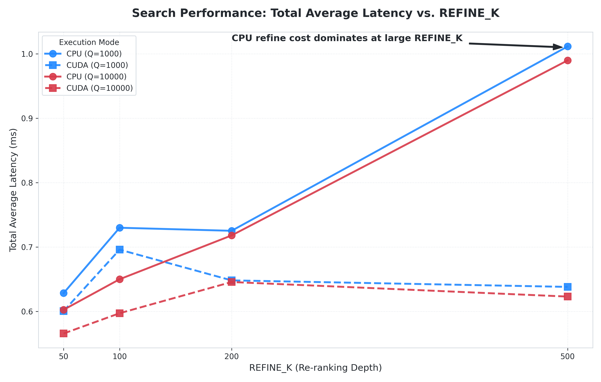
</picture>

**Figure CU1.** Total average latency (ANN + refine) vs `REFINE_K`, comparing **CPU refine** vs **CUDA refine** (ANN remains CPU/FAISS).  
> Note: `Q=1000` is a **short-run** measurement and is more sensitive to run-to-run variance; `Q=10000` better reflects **steady-state** throughput.

**Reading the curve.** With ANN fixed on CPU, CUDA refinement mainly matters when `REFINE_K` becomes large (e.g., 200–500), where CPU refine begins to dominate TOTAL Avg, while CUDA keeps TOTAL Avg comparatively flat.

---

## CU2 — Refinement stage only: per-query cost (CPU vs CUDA)

<picture>
  <source media="(prefers-color-scheme: dark)" srcset="performance_images/CU1_Refine_CPU_vs_CUDA_dark.png">
  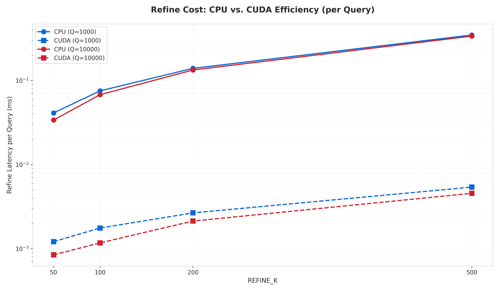
</picture>

**Figure CU2.** **Refine stage only (distance + top-k)** latency per query, derived from `refine_ms_per_q`.  
This intentionally excludes ANN time and should not be interpreted as end-to-end latency.

**CUDA timing scope.** CUDA refine includes **H2D (queries + candidate IDs)**, **kernel**, and **D2H (top-k ids/dist)**. Base vectors are **cached on GPU** and excluded from per-run H2D.

---

## CU2b — Kernel-level optimization: half2 + ILP vectorization (FP16 base)

Before evaluating alternative merge strategies (e.g., warp-level merge), we first optimized the **FP16 L2 distance kernel** by introducing **half2-based loading/compute and instruction-level parallelism (ILP)**. This targets the dominant portion of CUDA refinement—the distance accumulation over `D=384`—and primarily reduces **kernel time** rather than transfer overhead.

Under the same workload (`R=500`, `Q=10000`, `k=10`, ids-only D2H; base vectors cached on GPU), the optimized kernel reduces CUDA refinement time as follows:

| Variant       | refine_ms_total (ms) | H2D (ms) | kernel (ms) | D2H (ms) | avg per query (ms/query) |
| ------------- | -------------------: | -------: | ----------: | -------: | -----------------------: |
| Pre-half2/ILP |              44.0914 |   1.4663 |     42.6056 |   0.0194 |                 0.004409 |
| half2 + ILP   |              29.8578 |   1.4494 |     28.3889 |   0.0194 |                 0.002986 |

**Table CU2b-1.** Illustrative single-run snapshots for the FP16 refine kernel.  
**Interpretation.** The improvement is overwhelmingly explained by the **kernel reduction** (42.61 → 28.39 ms), while H2D and D2H remain essentially unchanged, consistent with a compute-side speedup from **vectorized FP16 loads** and **higher ILP** in the inner loop.

> Note: These example measurements were collected with `CUDA_PINNED=1` and `CUDA_RETURN_DIST=0` (ids-only). Base vectors are cached on GPU and excluded from per-run H2D. Paired statistical comparisons are reported in CU4.

---

## CU3 — Latency breakdown (Avg): ANN (CPU) + Refinement (CPU vs CUDA), Q=10000

<picture>
  <source media="(prefers-color-scheme: dark)" srcset="performance_images/CU1_Breakdown_Bar_dark.png">
  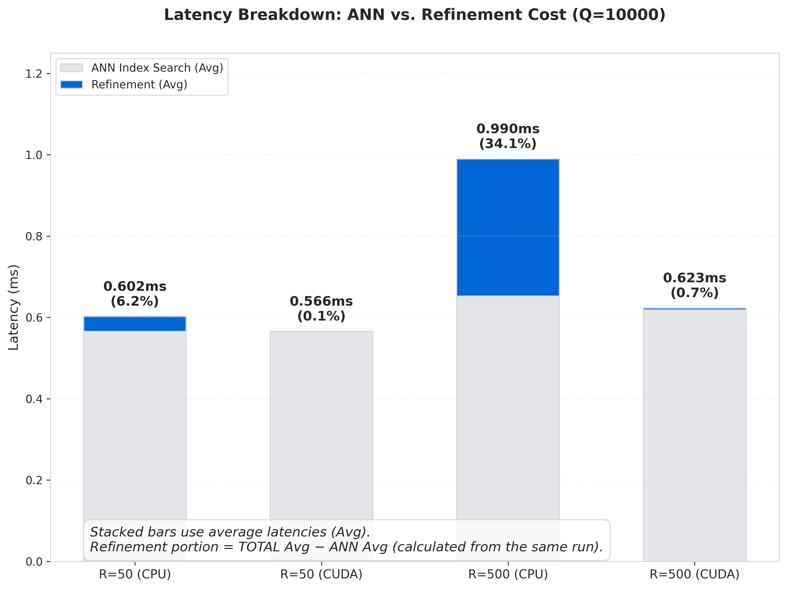
</picture>

**Figure CU3.** Average-latency decomposition at representative `REFINE_K` values.  
Refinement portion is computed as **TOTAL Avg − ANN Avg** (from the same run), highlighting that in this phase the **only GPU acceleration is refinement**.

---

## CU4 — Warp-merge vs. baseline: paired Δ (nPairs=30, 95% CI)

To evaluate whether **warp-level merging** improves the CUDA refinement kernel beyond the baseline block-level merge, we run a paired A/B test under identical conditions (same Q, same candidates, same `R=500`, same build), alternating `CUDA_KERNEL_MODE=baseline` and `CUDA_KERNEL_MODE=warpmerge`. We report paired mean differences with 95% CI. Negative Δ indicates warp-merge is faster.

We track two metrics:
- **Total refine Δ (incl. H2D/D2H)**: paired Δ on `refine_ms_per_q` (H2D + kernel + D2H).
- **Kernel-only Δ**: paired Δ on `refine_kernel_ms_per_q` (kernel time only), to isolate compute/merge behavior from transfer effects.

**Test scope (baseline policy):** `CUDA_PINNED=0`, `CUDA_RETURN_DIST=0` (ids-only), `PIPELINE=staged`, `R=500`, `D=384`.

<picture>
  <source media="(prefers-color-scheme: dark)" srcset="performance_images/CU4_Q10000_dark.png">
  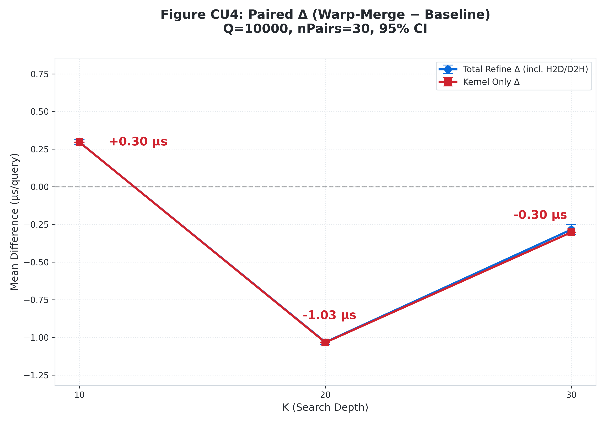
</picture>

**Figure CU4a.** Paired Δ (warp-merge − baseline), `Q=10000`, `nPairs=30`, 95% CI.  
Y-axis is **µs/query**. Blue is total refine Δ (incl. H2D/D2H); red is kernel-only Δ.

<picture>
  <source media="(prefers-color-scheme: dark)" srcset="performance_images/CU4_Q1000_dark.png">
  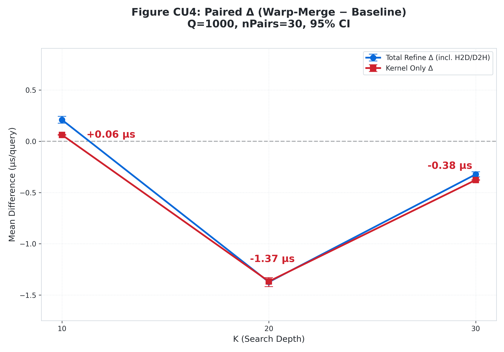
</picture>

**Figure CU4b.** Same paired Δ analysis under `Q=1000` (short-run). This setting is more sensitive to run-to-run variance, but is useful to confirm whether kernel-only direction matches steady-state runs.

|     Q |  K | Metric      | meanDiff (ms/query) | 95% CI (ms/query)      | Interpretation   |
| ----: | -: | ----------- | ------------------: | ---------------------- | ---------------- |
|  1000 | 10 | kernel-only |           +0.000063 | [+0.000059, +0.000067] | warpmerge slower |
|  1000 | 20 | kernel-only |           −0.001367 | [−0.001374, −0.001360] | warpmerge faster |
|  1000 | 30 | kernel-only |           −0.000377 | [−0.000382, −0.000372] | warpmerge faster |
| 10000 | 10 | kernel-only |           +0.000296 | [+0.000295, +0.000297] | warpmerge slower |
| 10000 | 20 | kernel-only |           −0.001034 | [−0.001036, −0.001031] | warpmerge faster |
| 10000 | 30 | kernel-only |           −0.000302 | [−0.000304, −0.000300] | warpmerge faster |

**Table CU4-1.** CU4 summary table (kernel-only)

**Interpretation.** Warp-merge shows a K-dependent behavior: it is slightly slower at `K=10`, but becomes measurably faster at `K=20/30`. Importantly, the same pattern appears in the **kernel-only** Δ, indicating the effect is attributable to the kernel’s merge/compute path rather than transfer variability.

---

## Takeaway (baseline `CUDA_PINNED=0`)

- **Correctness preserved:** CUDA refinement matches CPU-refined recall under the same candidates (verified via GT-cached evaluation).
- **Where CUDA helps:** As `REFINE_K` grows, CPU refinement starts to dominate end-to-end latency; CUDA keeps refinement cost small, improving TOTAL Avg especially in steady-state runs (`Q=10000`).
- **What remains CPU-bound:** Candidate generation (FAISS OPQ-PQ search) still determines most of the “floor” latency at moderate `REFINE_K`.
- **Kernel strategy insight (CU4):** Warp-merge is not universally better; it depends on **K**. In this setup, warp-merge is slower at `K=10` but faster at `K=20/30`, and the effect is visible in kernel-only timings.

---

## Optional: pinned host memory (`CUDA_PINNED=1`)

Pinned memory can reduce **H2D** time (queries + candidate IDs). In this phase, it is treated as an optional improvement rather than baseline. If enabled, report pinned results side-by-side with baseline for the same (`Q`, `REFINE_K`) to avoid conflating “algorithmic gain” with “transfer optimization.”

## CU5 — Warp-merge vs. baseline: paired Δ vs. K (kernel-only, Q=10000, R=500)

We investigate the hypothesis that the **warp-merge benefit is merge-bound and sensitive to block parallelism**, by repeating the paired A/B test while **forcing CUDA block threads** (`CUDA_BLOCK_THREADS ∈ {128, 256}`) and sweeping `k ∈ {10,20,30}` under a fixed refinement budget (`REFINE_K=500`, `R=500`, `D=384`).
We report `paired mean differences` (warpmerge − baseline) with **95% CI** over `nPairs=30 `runs. **Negative Δ means warp-merge is faster.** Baseline settings: `CUDA_PINNED=0`, `CUDA_RETURN_DIST=0 (ids-only)`, `PIPELINE=staged`, OPQ-PQ (`nlist=4096`, `nprobe=64`), 500K FP16 base, GT-cached L2.

### CU5-A — Kernel-only Δ vs K (primary evidence)
<picture> <source media="(prefers-color-scheme: dark)" srcset="performance_images/CU5_A_Kernel_Dark.png"> 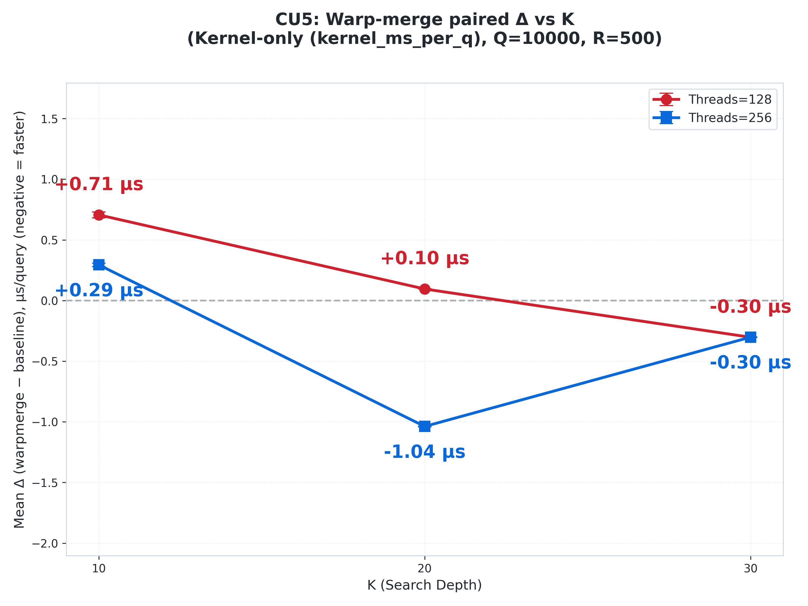 </picture>

**Figure CU5-A.** Paired Δ on **kernel-only** time (**Δkernel = warpmerge − baseline**, measured by `refine_kernel_ms_per_q`) vs `k`, comparing forced `CUDA_BLOCK_THREADS=128` vs `256` (Q=10000, R=500). This isolates compute/merge behavior from H2D/D2H transfer variability.

|     Q | Threads |  K | Metric      | meanDiff (ms/query) | 95% CI (ms/query)      | Interpretation                      |
| ----: | ------: | -: | ----------- | ------------------: | ---------------------- | ----------------------------------- |
| 10000 |     128 | 10 | kernel-only |           +0.000706 | [+0.000681, +0.000730] | warpmerge slower                    |
| 10000 |     128 | 20 | kernel-only |           +0.000095 | [+0.000094, +0.000097] | warpmerge slower                    |
| 10000 |     128 | 30 | kernel-only |           −0.000303 | [−0.000305, −0.000301] | warpmerge faster                    |
| 10000 |     256 | 10 | kernel-only |           +0.000294 | [+0.000279, +0.000309] | warpmerge slower                    |
| 10000 |     256 | 20 | kernel-only |           −0.001038 | [−0.001041, −0.001036] | **warpmerge faster (largest gain)** |
| 10000 |     256 | 30 | kernel-only |           −0.000302 | [−0.000304, −0.000300] | warpmerge faster                    |

**Table CU5-1.** Kernel-only summary (paired Δ, Q=10000, nPairs=30)

**Interpretation.** Warp-merge exhibits a clear (K, threads) interaction:

* At **K=10**, warp-merge is slower at both thread settings, consistent with its fixed shared/synchronization overhead outweighing any merge benefit when `K` is small.
* At **Threads=256**, warp-merge becomes strongly beneficial at **K=20** (≈ −1.04 μs/query) and remains beneficial at **K=30** (≈ −0.30 μs/query).
* At **Threads=128**, warp-merge remains slightly slower at **K=20** and only becomes beneficial at **K=30**.

This pattern supports the hypothesis that warp-merge helps primarily when the baseline’s **block-level merge/top-K maintenance** becomes expensive enough (higher K and/or higher per-block parallelism), but the benefit diminishes again once added shared-memory traffic and synchronization pressure dominate.

### CU5-B — Total refine Δ sanity check (incl. H2D + kernel + D2H)

**Figure CU5-B.** Paired Δ on **total refine** time (**Δtotal = warpmerge − baseline**, measured by `refine_ms_per_q`) vs k, under the same forced thread settings (Q=10000, R=500). Total refine includes **H2D + kernel + D2H**, so effect sizes are expected to be smaller than kernel-only.

|     Q | Threads |  K | Metric       | meanDiff (ms/query) | 95% CI (ms/query)      | Interpretation   |
| ----: | ------: | -: | ------------ | ------------------: | ---------------------- | ---------------- |
| 10000 |     128 | 10 | total refine |           +0.000705 | [+0.000678, +0.000732] | warpmerge slower |
| 10000 |     128 | 20 | total refine |           +0.000107 | [+0.000086, +0.000128] | warpmerge slower |
| 10000 |     128 | 30 | total refine |           −0.000306 | [−0.000327, −0.000285] | warpmerge faster |
| 10000 |     256 | 10 | total refine |           +0.000294 | [+0.000274, +0.000313] | warpmerge slower |
| 10000 |     256 | 20 | total refine |           −0.001043 | [−0.001069, −0.001016] | warpmerge faster |
| 10000 |     256 | 30 | total refine |           −0.000275 | [−0.000308, −0.000242] | warpmerge faster |

**Table CU5-2.**  Total refine summary (paired Δtotal, Q=10000, nPairs=30).

**Takeaway.** CU5-B confirms that the **K=20 peak at Threads=256** is not a transfer artifact: the strongest improvement is present in **kernel-only** (CU5-A) and remains after adding H2D/D2H (CU5-B), although the absolute magnitude can be diluted by transfer components. Together, CU5-A and CU5-B show that warp-merge’s advantage is conditional on **block parallelism** and `K`, consistent with a **merge-cost vs shared-memory/synchronization overhead** tradeoff.

## CU6 — NCU mechanism snapshot (why the K=20, threads=256 peak is largest)

To ground the CU5 paired Δ results in micro-architectural evidence, we collect **Nsight Compute (NCU)** counters on representative points under the same workload (`Q=10000`, `R=500`, `nprobe=64`, `REFINE_K=500`, `CUDA_PINNED=0`, `CUDA_RETURN_DIST=0`). This section focuses on **kernel behavior** (merge + shared-memory effects), not end-to-end latency.

### CU6.1 Performance deltas with opt-in context (kernel-only, warpmerge − baseline)

We first restate the kernel-only Δ behavior under forced block sizes. Δ is defined as:

* **Δkernel (µs/query) = warpmerge − baseline** on `refine_kernel_ms_per_q`
* Negative means warp-merge is faster

<picture> <source media="(prefers-color-scheme: dark)" srcset="performance_images/CU6_PerfDelta_Threads128_Dark.png"> 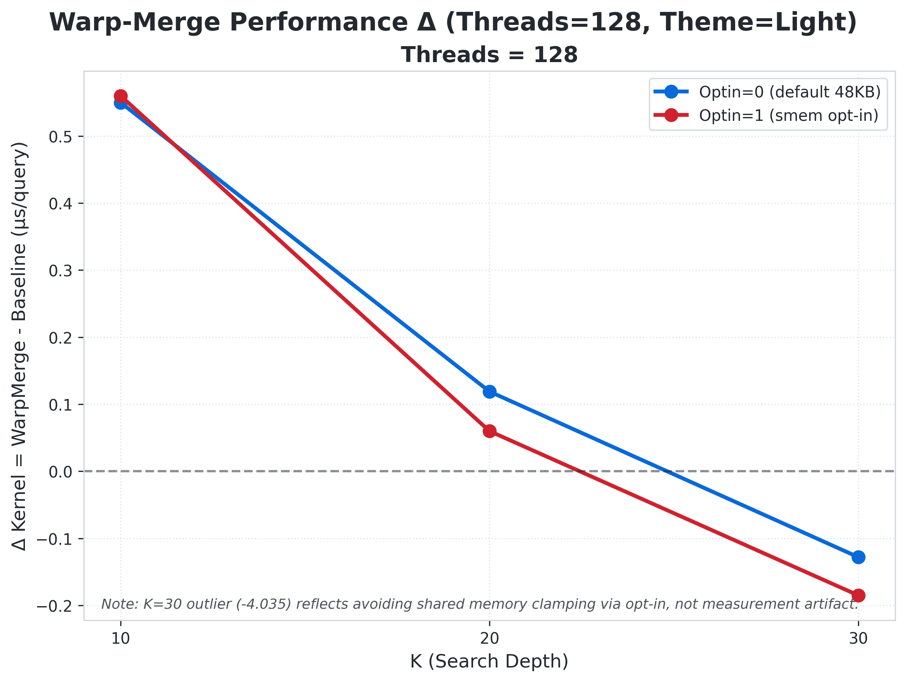 </picture>

**Figure CU6-1.** Kernel-only Δ vs K under `CUDA_BLOCK_THREADS=128`, split by `CUDA_SHMEM_OPTIN `(Optin=0: default 48KB/block; Optin=1: smem opt-in). Baseline and warp-merge runs use identical candidate sets and environment.

<picture> <source media="(prefers-color-scheme: dark)" srcset="performance_images/CU6_PerfDelta_Threads256_Dark.png"> 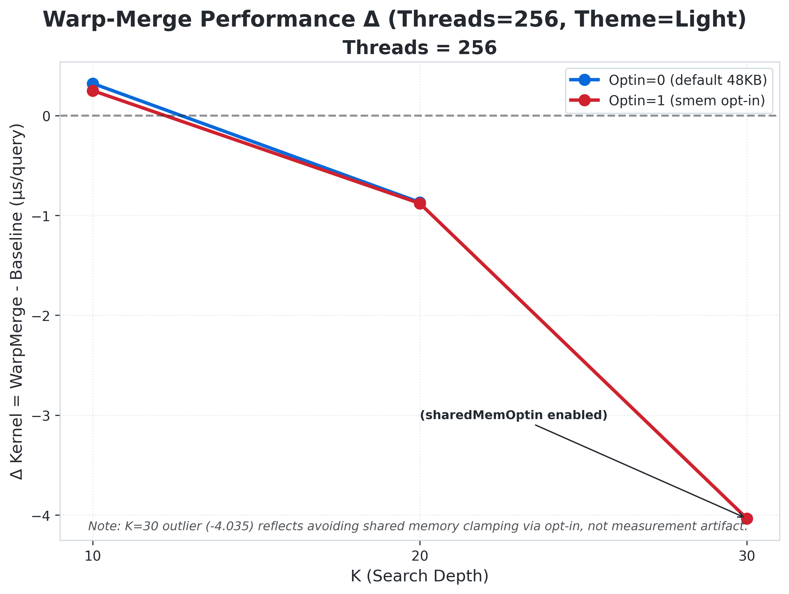 </picture>

**Figure CU6-2.** Kernel-only Δ vs K under `CUDA_BLOCK_THREADS=256`.
**Note (important):** `K=30, Threads=256, Optin=1 `is an “opt-in only” configuration; without opt-in the implementation would clamp to fewer threads due to shared-memory limits. The large negative Δ at that point reflects a *different* launch configuration enabled by opt-in (not a measurement artifact), so we interpret it separately from the default 48KB regime.

### CU6.2 Shared-memory traffic grows with K (warpmerge adds LD/ST wavefronts)

Warp-merge’s design reads/writes shared memory in additional stages. We quantify that as the delta in shared-memory load wavefronts:

* `ΔshLdWf = Δ smsp__sass_l1tex_data_pipe_lsu_wavefronts_mem_shared_op_ld.sum`

<picture> <source media="(prefers-color-scheme: dark)" srcset="performance_images/CU6_ShLdWf_Threads128_Dark.png"> 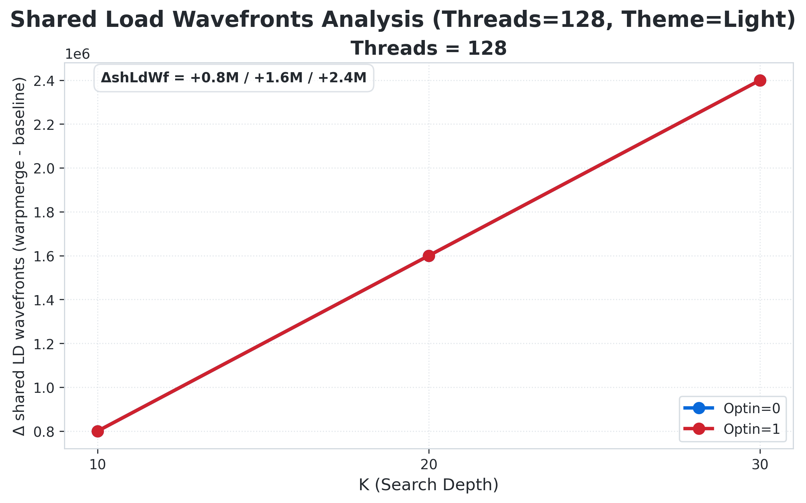 </picture>

**Figure CU6-3.** `Threads=128`. Warp-merge consistently increases shared LD wavefronts, scaling with K (≈ +0.8M / +1.6M / +2.4M for K=10/20/30).

<picture> <source media="(prefers-color-scheme: dark)" srcset="performance_images/CU6_ShLdWf_Threads256_Dark.png"> 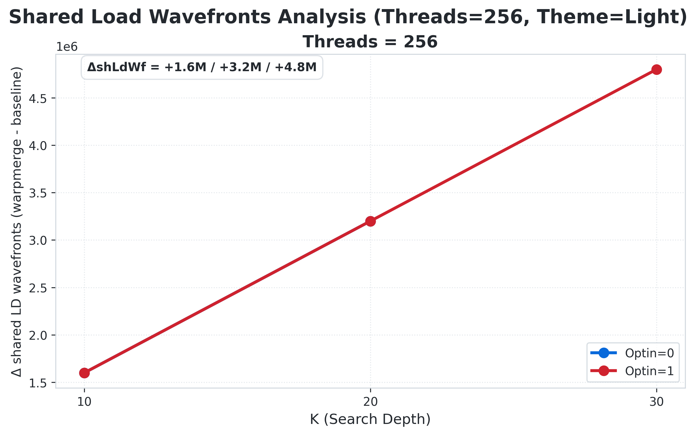 </picture>

**Figure CU6-4.** `Threads=256`. The shared-memory pressure is larger (≈ +1.6M / +3.2M / +4.8M), consistent with more warps contributing to shared staging and merge.

### CU6.3 Bank-conflict vs speed: “more conflicts” does not necessarily mean “slower”

Bank conflicts on shared loads rise sharply for warp-merge, especially at higher K. We plot:

* x-axis: `ΔBankLD = Δ l1tex__data_bank_conflicts_pipe_lsu_mem_shared_op_ld.sum`
* y-axis: `ΔKernel (µs/query)` (kernel-only, warpmerge − baseline)

<picture> <source media="(prefers-color-scheme: dark)" srcset="performance_images/CU6_Scatter_BankLD_Kernel_Th128_Dark.png"> 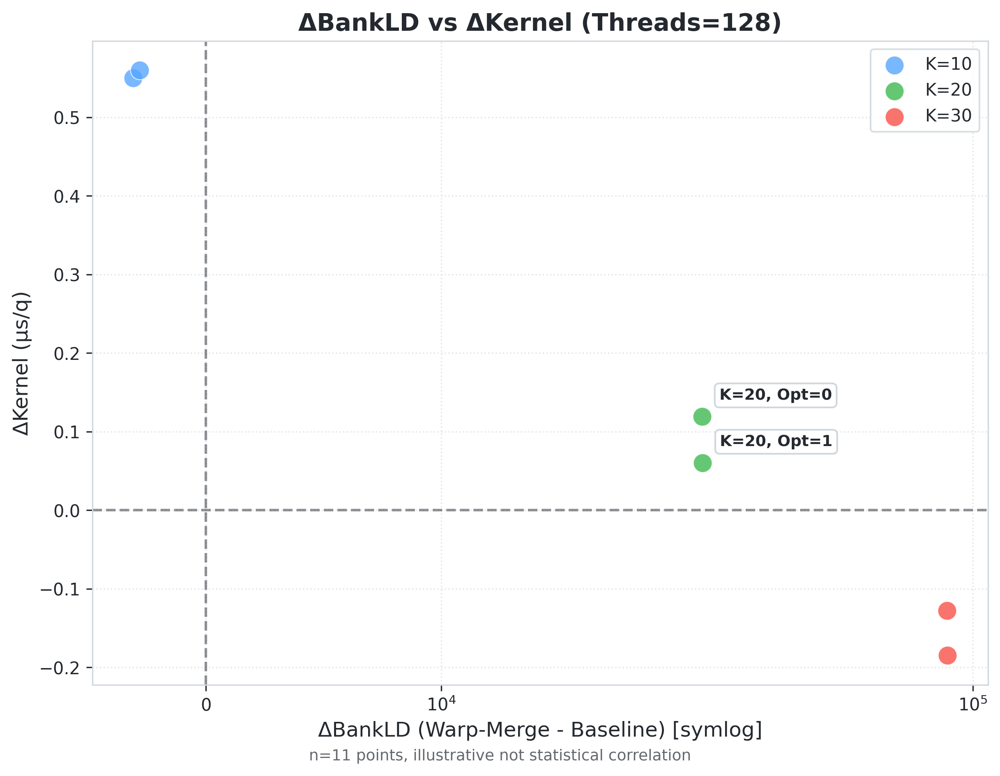 </picture>

**Figure CU6-5.** `Threads=128`. Warp-merge increases bank conflicts for K=20/30, but the performance outcome depends on whether merge savings can amortize the added shared traffic.

<picture> <source media="(prefers-color-scheme: dark)" srcset="performance_images/CU6_Scatter_BankLD_Kernel_Th256_Dark.png"> 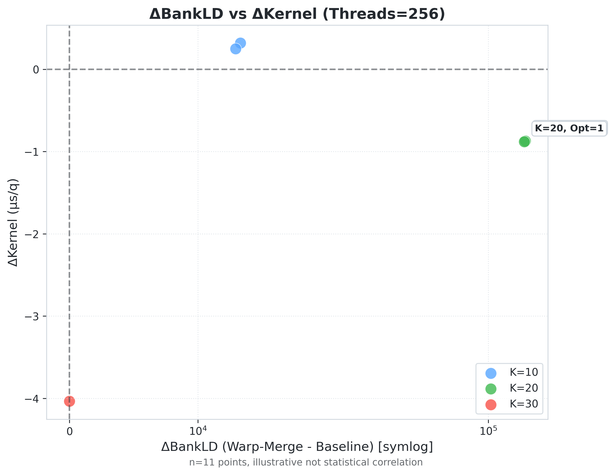 </picture>

**Figure CU6-6.** `Threads=256`. The “peak gain” case (K=20) occurs despite a very large increase in shared LD bank conflicts, implying the dominating benefit comes from reduced merge work, not reduced shared contention.

### CU6.4 Stall mechanism snapshot (Threads=256, Optin=0)

To make CU6 concrete, we show the stall deltas for Threads=256, Optin=0:
* Barrier stall: `smsp__warp_issue_stalled_barrier_per_warp_active.pct`
* Long scoreboard stall: `smsp__warp_issue_stalled_long_scoreboard_per_warp_active.pct`
* Short scoreboard stall: `smsp__warp_issue_stalled_short_scoreboard_per_warp_active.pct`

<picture> <source media="(prefers-color-scheme: dark)" srcset="performance_images/CU6_Delta_Stall_Breakdown_Dark.png"> 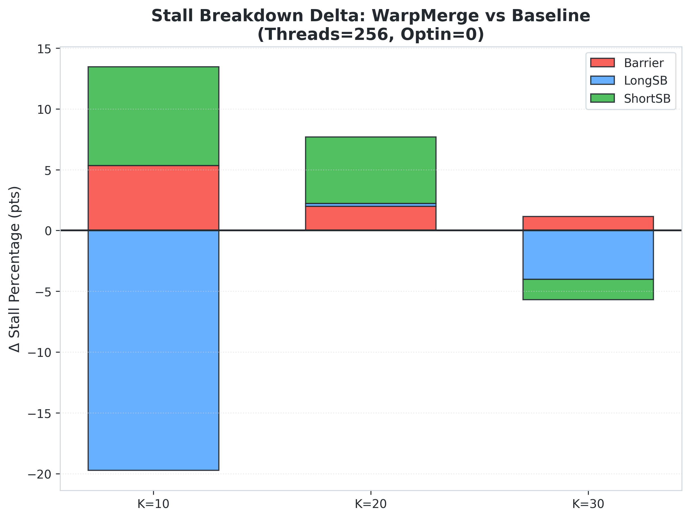 </picture>

**Figure CU6-7.** Stall breakdown delta (warpmerge − baseline) at `Threads=256, Optin=0`.
Interpretation: warp-merge tends to increase barrier and short-scoreboard stalls (extra synchronization / shared-memory interactions), while long-scoreboard behavior may shift depending on K. The performance outcome depends on whether merge-work reduction dominates these added stalls.

### CU6.5 Representative counter deltas (warpmerge − baseline) at Threads=256

We summarize two representative points at Threads=256 (Optin=0, default 48KB regime) using NCU counters (single-kernel invocation):

* **Counterexample (slow):** `K=10, Threads=256, Optin=0`
* **Peak-gain (fast):** `K=20, Threads=256, Optin=0`

| Case (Q=10000, R=500)     | gpu__time_duration.sum (ms) | Barrier stall Δ (pp) | Short scoreboard stall Δ (pp) | Shared LD wavefronts Δ | Shared ST wavefronts Δ | Shared bank conflicts LD Δ | Branch uniformity Δ (pp) |
| ------------------------- | --------------------------: | -------------------: | ----------------------------: | ---------------------: | ---------------------: | -------------------------: | -----------------------: |
| **K=10, th=256, optin=0** |                 **+5.3836** |           **+5.334** |                    **+8.125** |              **+1.6M** |              **+1.6M** |                **+13,309** |               **−0.087** |
| **K=20, th=256, optin=0** |                **−18.4749** |           **+1.989** |                    **+5.487** |              **+3.2M** |              **+3.2M** |               **+144,492** |               **−0.046** |

**Table CU6-2.** Mechanism snapshot at `Threads=256 (Optin=0)`.
Notes:
(i) `gpu__time_duration.sum` is the kernel duration for the profiled launch (one invocation).
(ii) Shared wavefronts use `smsp__sass_l1tex_data_pipe_lsu_wavefronts_mem_shared_op_{ld,st}.sum`.
(iii) Branch uniformity uses `smsp__sass_average_branch_targets_threads_uniform.pct` (Δ shown in percentage points).

### CU6.6 Interpretation: why K=20 at Threads=256 is the “sweet spot”

1. **Warp-merge predictably increases shared-memory traffic and synchronization exposure.**
Across all K, warp-merge increases shared LD/ST wavefronts (CU6.2) and often increases bank-conflict load events (CU6.3). It also tends to increase barrier/short-scoreboard stalls (CU6.4). These are the “cost terms” of warp-merge.

2. **The K-dependent outcome is whether merge savings outweigh those shared/sync costs.**
* At **K=10**, baseline’s merge is relatively cheap, so warp-merge’s extra staging and synchronization is not amortized; the kernel gets slower (CU6.5: `gpu__time_duration.sum` +5.38 ms).
* At **K=20**, baseline’s merge work becomes expensive enough that warp-merge’s structure reduces effective merge work sufficiently to dominate the added shared costs, producing the largest observed speedup at `Threads=256` (CU6.5: `gpu__time_duration.sum` −18.47 ms and CU6.1/CU5: Δkernel ≈ −0.869 µs/query).
* At **K=30**, warp-merge can still help, but shared-memory pressure continues to grow with K; the net effect becomes more sensitive to the exact launch configuration and shared-memory limits (see CU6.1 note on opt-in enabling 256 threads at high K).

3. **Branch divergence is not the driver here.**
Branch uniformity stays extremely high (~99.9%+) and deltas are tiny (≤0.1 pp). The dominant signals are shared traffic (wavefronts/bank conflicts) and synchronization/scoreboarding stalls.

**Takeaway.** CU6 provides mechanism-level evidence supporting CU5’s headline: warp-merge wins most strongly when baseline merge work is large enough to amortize warp-merge’s added shared/synchronization overhead. In this workload, that “sweet spot” appears around **K=20** with **Threads=256** under the default shared-memory regime (Optin=0).