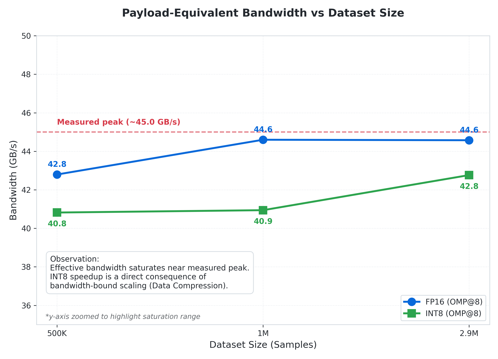
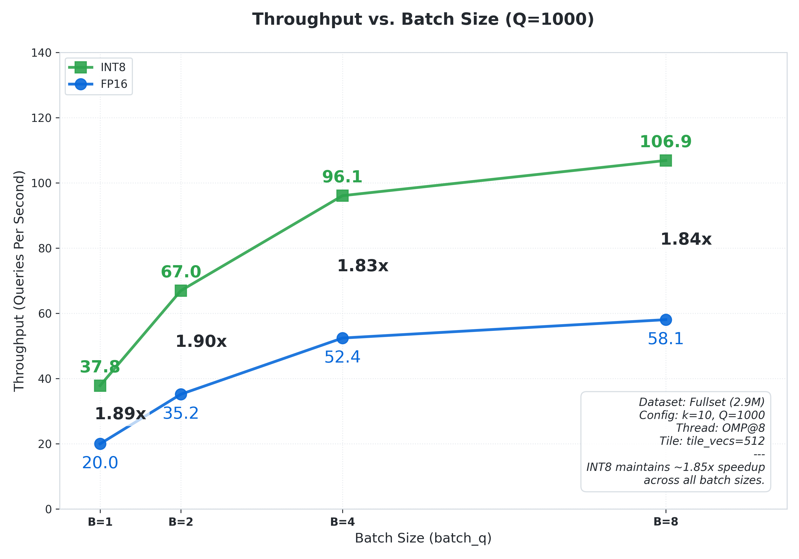
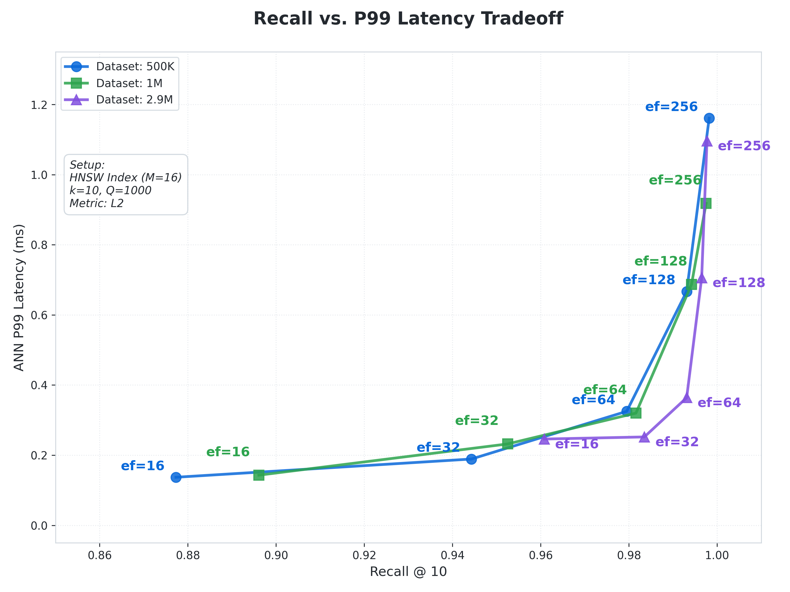
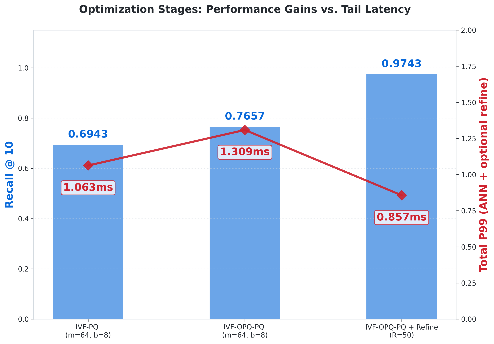

# Nano-VectorDB

Nano-VectorDB is a research-grade C++ vector search benchmark built to study **system bottlenecks** in dense retrieval—especially the transition from **compute-bound** to **memory-bandwidth–bound** behavior, and the tradeoffs introduced by **compression** and **ANN indexing**.

- Full technical report: **`performance.md`**
- Short digest for readers/HR: **`performance_summary.md`**
- Reproducibility guide (build + run commands): **`REPRO.md`** (recommended; keep README short)

---

## Highlights (TL;DR)

### Flat-scan (Exact) bottleneck characterization
- **~5× parallel speedup** vs single-thread flat scan, reaching **~44–45 GB/s** effective bandwidth (CPU ceiling)
- **~2.7× single-thread speedup** from **AVX2+FMA**, then performance transitions to **bandwidth-bound**
- **FP16** halves bytes/query and reaches bandwidth saturation with fewer threads (hybrid CPU effects observed)
- **INT8(+scale) AVX2 kernel** delivers **~1.8–1.9× throughput vs FP16** on large datasets (exact top-k within INT8 scoring space)

### ANN baselines and compression ladder
- **HNSW baseline**: efSearch sweep and build-parameter sweep (M, efConstruction) quantify **recall–latency–memory** tradeoffs
- **IVF-Flat vs IVF-(OPQ)PQ+Refine**:
  - IVF-Flat retains large footprint (raw vectors dominate)
  - IVF-(OPQ)PQ compresses to **tens of MB** and **Refine** recovers high Recall@10 with small tail-cost

---

## Key Figures (Representative)

### 1) Bandwidth ceiling (flat scan)
<picture>
  <source media="(prefers-color-scheme: dark)" srcset="performance_images/P4B_2_Bandwidth_Refined_dark.png">
  
</picture>

### 2) Query batching throughput (INT8 vs FP16)
<picture>
  <source media="(prefers-color-scheme: dark)" srcset="performance_images/P7_Batching_QPS_dark.png">
  
</picture>

### 3) HNSW recall–tail tradeoff
<picture>
  <source media="(prefers-color-scheme: dark)" srcset="performance_images/P6_1_Tradeoff_Updated_dark.png">
  
</picture>

### 4) Compressed IVF stage ladder (PQ → OPQ-PQ → Refine)
<picture>
  <source media="(prefers-color-scheme: dark)" srcset="performance_images/Stages_Evolution_dark.png">
  
</picture>

> Note: `performance.md` contains the full sweep surfaces and grids (nlist/nprobe, refine grids, etc.). README intentionally shows only representative figures.

---

## Project Goals

Nano-VectorDB is intentionally minimal to make bottlenecks **explicit, measurable, and reproducible**:

1. **Infrastructure**: zero-copy loading of large embedding matrices via `mmap`
2. **Exact baseline**: correctness-first flat-scan Top-k as ground truth reference
3. **Bottleneck isolation**: controlled experiments for threading, SIMD, bandwidth ceilings
4. **Data movement reduction**: FP16 / INT8(+scale), batching/tiling/prefetch
5. **ANN & compression**: HNSW / IVF / IVF-(OPQ)PQ + refine (candidate-gen + small exact rerank)

---

## Current Status (Checklist)

### ✅ Phase 1 — Infrastructure & Zero-Copy I/O
- [x] CMake/Ninja project structure
- [x] `mmap`-based dataset loader
- [x] vecbin format (dtype-aware: FP32/FP16/INT8+scale)
- [x] correctness checks (`nvdb_dump`, `nvdb_sanity`)

### ✅ Phase 2 — Baseline Retrieval
- [x] exact flat-scan Top-k baseline (ST/OMP/POOL)
- [x] benchmark harness (avg/QPS/p95/p99) + derived metrics (bytes/query, effective bandwidth)

### ✅ Phase 3 — Parallelism & SIMD
- [x] OpenMP, std::async, pinned thread-pool
- [x] AVX2+FMA dot kernel; compute-bound → bandwidth-bound transition

### ✅ Phase 4 — Reduce Data Movement (FP16)
- [x] FP16 conversion tool + benchmarks across 500K / 1M / 2.9M
- [x] hybrid Alder Lake affinity pitfalls documented

### ✅ Phase 4B — INT8 Base Quantization (AVX2)
- [x] INT8(+scale) format + AVX2 kernel
- [x] throughput advantage quantified (vs FP16), cross-size

### ✅ Phase 5 — Query Batching / Cache Tiling / Prefetch (Exploratory)
- [x] batching metrics (batch-level percentiles)
- [x] tile sweep + prefetch sweep

### ✅ Phase 6 — ANN Baseline (HNSW)
- [x] build + eval tools
- [x] efSearch sweep across sizes
- [x] build-parameter sweep (M, efConstruction)

### ✅ Phase 6B/6C — IVF / IVF-(OPQ)PQ + Refinement
- [x] IVF-Flat nlist/nprobe surface + build footprint
- [x] IVF-PQ / OPQ-PQ baseline
- [x] refine sweeps (yield/cost + nprobe×refine grid + Pareto view)

### ⏳ Next (Planned)
- [ ] Phase 7: End-to-end RAG-oriented experiments (IO + retrieval + rerank)
- [ ] Phase 8: GPU path (CUDA kernels / GPU ANN baselines) — optional research track

---

## Quick Links
- `performance_summary.md` — short version (recommended for readers)
- `performance.md` — full report (all sweeps, figures, tables)
- `REPRO.md` — how to build + reproduce experiments (kept out of README to reduce length)

---

## Hardware / Environment (Reference)
- CPU: Intel Core i7-12700 (8P + 4E / 20 threads), Alder Lake hybrid
- Memory: 32GB DDR4-3200 dual-channel
- OS: Arch Linux (Kernel 6.12.63-lts)
- Compiler: GCC 15.2.1 (`-O3 -mavx2 -mfma -pthread`)
- GPU (optional track): NVIDIA RTX 3080 (12GB), CUDA driver/toolkit available
